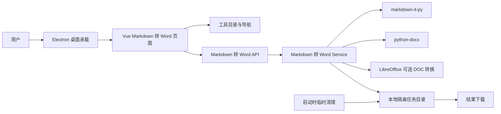
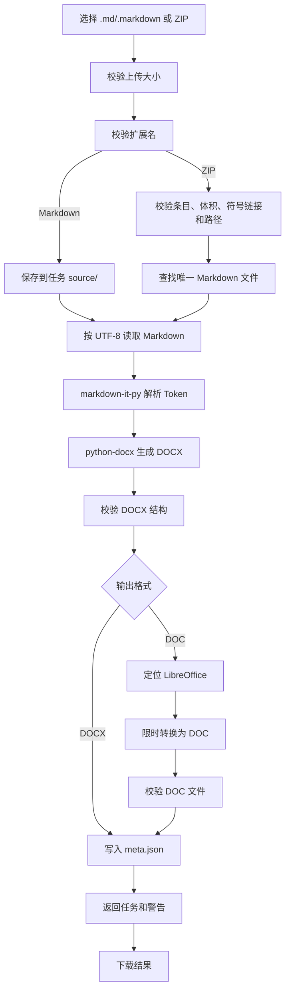

# Markdown 转 Word 模块开发设计

> 本文档针对“工具盒子”中的 Markdown 转 Word 模块，描述该模块的需求、项目内结构与流程、数据库和 API 设计。当前实现支持 Markdown 文件或资源 ZIP 输入，生成 DOCX，并可通过 LibreOffice 转换为 DOC。

---

## 1. 需求

### 1.1 已确认的项目事实

| 事项 | 当前项目事实 |
| --- | --- |
| 应用形态 | Electron 承载 Vue 3 + TypeScript 前端，并启动本地 FastAPI 服务。 |
| 后端入口 | `backend/app/main.py` 注册 FastAPI 生命周期、工具路由和统一异常处理。 |
| 后端模块组织 | 工具按 `api/v1/tools`、`schemas/tools`、`services/tools` 组织；Markdown 转 Word 复用该结构。 |
| API 契约 | 接口统一使用 POST；普通响应使用 `{code, message, data}`，由 `success()` / `error()` 构造。 |
| 文件任务 | 文件工具使用 `get_task_dir(task_id)` 保存任务输入、资源、中间结果和下载产物。 |
| 临时数据清理 | `cleanup_expired_temp()` 在服务启动时清理超过 24 小时的临时任务。 |
| Markdown 解析 | 依赖 `markdown-it-py`，使用 CommonMark 解析器并启用表格、删除线扩展。 |
| DOCX 生成 | 使用 `python-docx` 生成文档并校验 `[Content_Types].xml`、`word/document.xml`。 |
| DOC 转换 | 选择 DOC 时先生成 DOCX，再调用配置中的 LibreOffice，以 `MS Word 97` 格式转换。 |
| 前端工具注册 | `frontend/src/router/tools.ts` 从后端工具列表合并本地组件注册表并动态生成工具路由。 |
| 数据库 | 当前文件处理工具不使用数据库保存任务记录；本模块不新增 SQLite 表。 |
| 当前实现状态 | 后端接口、DOCX/DOC 转换、ZIP 资源处理、前端工具页面和工具目录注册均已接入；跨平台打包验收仍需单独执行。 |

### 1.2 模块目标

为用户提供一个独立的本地 Markdown 转 Word 工具：用户上传 Markdown 文件，或上传包含一个 Markdown 文件及其相对资源的 ZIP 文件，选择 DOCX 或 DOC，系统在本机完成转换并提供下载。

DOCX 是主转换产物。DOC 仅作为兼容输出格式，通过本地 LibreOffice 对已生成的 DOCX 进行后处理；LibreOffice 缺失时不影响 DOCX 输出。

### 1.3 功能需求

1. **Markdown 文件接入**
   - 支持 `.md`、`.markdown` 文件。
   - 单文件上传上限为 50MB。
   - Markdown 按 UTF-8 读取；编码无法解析时返回内容错误。
   - 上传文件名只用于识别和输出命名，不直接作为任务路径。

2. **Markdown 资源 ZIP 接入**
   - 支持 `.zip` 文件，ZIP 内必须包含且只能包含一个 `.md` 或 `.markdown` 文件。
   - ZIP 内的 `images/` 目录是当前推荐资源组织方式，但不是强制目录名；图片和其他相对资源必须位于 Markdown 所在目录或其子目录内。
   - ZIP 最多包含 512 个条目，解压后总大小不能超过 200MB。
   - 拒绝绝对路径、`..` 路径、符号链接和其他路径逃逸内容。

3. **Markdown 转 DOCX**
   - 支持标题、段落、粗体、斜体、删除线、链接、无序/有序列表、引用、分割线、代码块、表格和图片。
   - 本地相对图片嵌入 DOCX；远程图片不主动下载并返回警告。
   - 支持符合限制的 Data URI 图片；单个 Data URI 图片不超过 10MB。
   - 生成结果后校验 DOCX 压缩包结构和核心文档文件。

4. **DOCX 转 DOC**
   - 用户选择 DOC 时，先完成 DOCX 生成和校验，再调用 LibreOffice 转换。
   - 转换超时时间为 120 秒。
   - LibreOffice 缺失、超时或未生成结果时返回明确错误，不返回内部命令和本地路径。

5. **结果交付**
   - 返回任务 ID、源文件名、输出文件名、输出格式和非致命转换警告。
   - 用户可下载 DOCX 或 DOC，也可以重新上传新的文件。
   - 任务结果按现有临时任务规则保留并自动清理。

### 1.4 非功能需求

- **本地优先**：Markdown、图片资源、DOCX 中间文件和 DOC 结果均在本地任务目录中处理，不上传云端。
- **安全性**：上传大小、扩展名、ZIP 条目、解压体积、符号链接、路径范围和任务 ID 均由服务端校验。
- **可靠性**：转换失败时删除本次半成品任务；只有输出文件校验完成后才写入任务元数据并返回成功。
- **可用性**：DOCX 不依赖 LibreOffice；DOC 选项依赖 LibreOffice，缺失时返回可理解的依赖错误。
- **性能**：当前接口为同步业务调用，不建立独立任务队列；复杂或大体积 Markdown 可能占用后端线程和本地 CPU/内存。
- **隐私**：日志只记录任务 ID、源文件名、输出格式和警告数量，不记录 Markdown 正文、图片内容或完整本地路径。
- **可维护性**：Markdown 解析和 DOCX 渲染位于 `markdown_docx.py`，上传、任务、DOC 转换和下载位于 Markdown 转 Word Service，Router 不承载转换规则。

### 1.5 当前范围、范围外事项与职责边界

**当前范围**：独立 Markdown 转 Word 工具、`.md/.markdown` 文件输入、带一个 Markdown 文件的 ZIP 输入、`images/` 相对图片资源、常用 Markdown 结构、DOCX 输出、LibreOffice DOC 后处理、任务隔离、结果下载和转换警告。

**明确不做**：

- 不支持 ZIP 中多个 Markdown 文档批量转换。
- 不抓取远程图片，不请求 Markdown 中的外部 URL。
- 不执行原始 HTML、脚本或其他可执行内容。
- 不承诺完整 GFM、脚注、数学公式、复杂 HTML、宏、嵌入式办公对象或高级 Markdown 扩展的版式还原。
- 不提供 Markdown 在线编辑器、长期文件库、账号同步、云端转换或版本历史。
- 不把 DOC 作为独立原生生成格式；DOC 始终由 DOCX 经过 LibreOffice 转换得到。

**职责边界**：

- 前端负责文件选择、格式选择、处理中/成功/失败状态和下载交互，不实现 Markdown 解析或 Word 文件生成。
- Router 负责接收 multipart/form-data、调用 Service、封装统一响应和返回 `FileResponse`。
- Schema 负责下载请求和转换结果的接口字段约束。
- Service 负责文件读取、ZIP 安全解包、任务目录、Markdown 内容读取、DOCX/DOC 生成、结果校验和下载路径校验。
- `markdown_docx.py` 负责 Markdown Token 到 DOCX 段落、列表、表格、代码、链接和图片的映射。
- 通用临时任务工具负责任务 ID、任务目录和过期清理，不负责 Markdown 语法或 Word 样式。
- LibreOffice 只负责 DOCX 到 DOC 的兼容格式转换，不负责 Markdown 解析。

### 1.6 可观察的验收标准

1. 工具目录、首页和侧边栏显示独立的“Markdown 转 Word”入口。
2. `.md`、`.markdown` 文件能生成可打开的 DOCX。
3. 包含一个 Markdown 文件和 `images/` 资源的 ZIP 能正确嵌入相对图片。
4. 标题、段落、列表、引用、表格、代码块、链接和常用行内格式能生成对应 Word 结构。
5. 选择 DOC 且 LibreOffice 可用时能生成非空 DOC 文件；选择 DOCX 时不依赖 LibreOffice。
6. ZIP 路径穿越、符号链接、多个 Markdown 文件、超过条目数或解压体积限制时拒绝处理。
7. 远程图片、缺失图片和不支持内容不会导致任务无提示失败，页面能展示转换警告。
8. 非 UTF-8 Markdown、空文件、超大文件、损坏 ZIP、转换超时和缺少 LibreOffice 时返回项目统一错误结构。
9. 下载只能访问合法任务目录中的已完成结果，非法或过期任务不能读取其他路径。
10. 任务过期后，输入副本、解包资源、中间 DOCX、DOC 和元数据均能按统一规则清理。

---

## 2. 该项目的模块结构与流程

### 2.1 在当前项目中的位置

当前项目采用“工具 Router + Schema + Service”后端结构，以及“远端工具目录 + 本地页面注册”的前端结构。Markdown 转 Word 模块沿用现有文件工具边界，不新增独立 FastAPI 服务、数据库层或桌面 IPC 通道。

| 设计位置 | 当前职责 | 当前状态 |
| --- | --- | --- |
| `backend/app/api/v1/tools/markdown_to_word.py` | 接收转换和下载请求，调用 Service，封装统一响应或 `FileResponse` | 已接入 |
| `backend/app/schemas/tools/markdown_to_word.py` | 定义下载请求和转换结果 Schema | 已接入 |
| `backend/app/services/tools/markdown_to_word.py` | 文件校验、ZIP 解包、Markdown 读取、任务目录、DOCX/DOC 转换、结果校验和下载 | 已接入 |
| `backend/app/utils/markdown_docx.py` | 使用 Markdown Token 生成 DOCX 段落、列表、表格、代码、链接和图片 | 已接入 |
| `backend/app/services/tools/list.py` | 注册 `markdown-to-word` 工具条目 | 已接入 |
| `backend/app/main.py` | 注册 Router；沿用现有 LibreOffice 检测和应用生命周期 | 已接入 |
| `frontend/src/api/tools.ts` | 提交 multipart 请求、解包响应、处理 Word 二进制下载和文件名 | 已接入 |
| `frontend/src/views/tools/MarkdownToWord.vue` | 文件选择、格式选择、状态展示、警告和下载 | 已接入 |
| `frontend/src/router/tools.ts` | 合并后端工具条目和本地页面组件，生成动态路由 | 已接入 |
| `backend/app/utils/temp_cleanup.py` | 提供任务目录、任务 ID 校验和过期清理 | 复用现有能力 |
| `backend/app/core/config.py` | 提供 LibreOffice 可执行文件定位 | 复用现有能力 |

### 2.2 项目级模块关系



工具目录通过现有 `POST /api/v1/tools/list` 返回 Markdown 转 Word 条目。前端页面通过 `frontend/src/api/tools.ts` 调用转换和下载接口；Service 返回业务结果或抛出 `ServiceException`，不返回 `ApiResponse`。

### 2.3 模块内部边界

1. **入口层**：Router 接收 multipart 文件和 `output_format`，接收下载 JSON Body，调用 `success()` / `error()`，成功下载返回 `FileResponse`。
2. **Schema 层**：`DownloadRequest` 约束 `task_id`；`ConvertResponse` 约束任务 ID、源文件名、输出文件名、输出格式和警告列表。
3. **业务层**：Service 负责所有文件、ZIP、任务目录、转换进程和结果文件规则；API 层不直接操作任务路径。
4. **渲染层**：`MarkdownDocxRenderer` 只接收 Markdown 文本、资源根目录和输出文档对象，不负责上传、任务 ID、LibreOffice 进程或下载授权。
5. **前端边界**：页面只保存当前选择的 File、输出格式、任务 ID、转换结果和页面状态；不写入 Pinia 或持久化存储。
6. **外部运行时边界**：LibreOffice 只在输出格式为 DOC 时调用；DOCX 由 Python 运行时直接生成。

### 2.4 核心处理流程



### 2.5 数据流、状态流与并发规则

| 状态 | 产生位置 | 页面表现 | 允许动作 |
| --- | --- | --- | --- |
| `upload` | 页面初始状态或重新上传 | 文件拖拽区、格式选择和 ZIP 说明 | 选择文件、选择输出格式 |
| `progress` | 转换请求发出后 | 显示不确定进度动画并禁止格式切换 | 等待结果；当前没有取消接口 |
| `result` | 转换和结果校验完成 | 显示输出文件名、格式、警告和下载按钮 | 下载或重新上传 |
| `error` | 文件校验、转换、下载或依赖错误 | 显示错误信息和重新上传入口 | 修正输入、切换格式或重新上传 |
| 任务过期 | 下载时任务目录已清理 | 显示下载失败 | 重新上传创建新任务 |

- 当前接口为同步 Router 函数，Markdown 解析、DOCX 写入和 DOC 转换在一次请求内完成，不使用普通 `BackgroundTasks` 或持久化任务队列。
- 同一页面通过处理中状态避免重复提交；后端没有跨请求幂等键和任务状态查询接口。
- 每次转换创建新的 12 位小写十六进制任务 ID，不做内容去重。
- DOC 转换使用任务专属 LibreOffice 用户配置目录，避免与其他 LibreOffice 进程共享用户配置。
- 失败时删除本次任务目录；成功后通过 `meta.json` 确定下载格式和安全输出文件名。
- 当前前端显示的是不确定进度，不代表真实百分比；若后续支持大文件或长文档，应评估拆分任务和进度查询。

### 2.6 关键技术选择

| 选择 | 当前决定 | 采用方式与原因 |
| --- | --- | --- |
| Markdown 解析 | 不引入 Pandoc 运行时 | 使用 `markdown-it-py` 解析常用 Markdown，避免为桌面安装包增加新的原生可执行依赖；复杂 Markdown 扩展不承诺完整还原。 |
| DOCX 生成 | 使用 `python-docx` | 项目已有该依赖，能够在内置 Python 后端中生成 DOCX，并允许控制标题、列表、表格、代码和图片映射。 |
| DOC 生成 | DOCX 后处理 | 复用项目已有 LibreOffice 定位和子进程能力；DOC 不是独立原生渲染链路。 |
| 图片资源 | ZIP 内相对路径 | 浏览器不能可靠地把本地目录作为单个 Markdown 上传，因此使用 ZIP 携带 Markdown 和 `images/` 资源，服务端限制资源根目录。 |
| 任务保存 | 复用临时任务目录 | 不新增数据库，保持文件工具的本地任务、下载和 24 小时清理边界。 |

### 2.7 待确认事项

- PyInstaller 在 macOS arm64 和 Windows x64 产物中对 `markdown-it-py`、`python-docx` 和其间接依赖的完整收集需要在目标平台构建中确认。
- DOC 输出在两个发布平台上的 LibreOffice 版本、字体和复杂表格兼容性需要形成验收样本。
- 当前没有完整 Markdown 兼容性基准集；正式发布前需要确定代表性 Markdown 样本和人工校对标准。

---

## 3. 数据库的设计

### 3.1 数据库使用结论

本模块**不直接持久化到数据库**，不新增 SQLite 表、SQLAlchemy Model、Repository、索引或数据库迁移。虽然项目配置存在通用 `DATABASE_URL`，但文件转换任务不使用该数据库保存任务状态或结果记录。

原因：Markdown、资源图片和 Word 结果属于短期本地处理产物，不需要账号关联、历史检索、跨设备同步或长期统计。将文件内容或任务记录写入数据库会扩大隐私、备份和清理边界。

### 3.2 临时任务文件结构

任务目录复用 `get_task_dir(task_id)`，典型结构如下：

```text
<TOOLBOX_DATA_DIR>/temp/tasks/{task_id}/
├── source/
│   ├── document.md                 # 直接上传的 Markdown，或 ZIP 解包后的目录
│   └── images/                     # 可选的相对图片资源
├── input.zip                       # ZIP 输入时保留的上传副本
├── output.docx                     # DOCX 输出或 DOC 转换中间结果
├── output.doc                      # 选择 DOC 时的最终结果
├── libreoffice-profile/            # DOC 转换使用的临时用户配置目录
└── meta.json                       # 输出格式、文件名和转换警告
```

直接上传 `.md` 时不创建 `input.zip`；选择 DOCX 时不要求生成 `output.doc` 或 LibreOffice 配置目录。

`meta.json` 当前字段如下：

| 字段 | 类型 | 可空 | 用途 |
| --- | --- | --- | --- |
| `filename` | string | 否 | 原始 Markdown 或 ZIP 文件名，用于日志和结果关联 |
| `output_filename` | string | 否 | 下载时使用的安全输出文件名 |
| `output_format` | `docx` / `doc` | 否 | 下载时确定结果后缀和媒体类型 |
| `warnings` | string[] | 否 | 缺失图片、远程图片或不支持内容等非致命警告 |

### 3.3 生命周期、事务与一致性

- **创建**：上传大小和扩展名通过初步校验后创建任务目录；Markdown 读取、解析、DOCX 生成或 DOC 转换失败时删除整个任务目录。
- **解包**：ZIP 先校验条目、体积、符号链接和路径，再写入 `source/`；不使用 `zipfile.extract()` 直接信任成员路径。
- **写入**：源文件、ZIP、DOCX、DOC 和元数据均位于当前任务目录；下载前再次校验任务 ID、任务路径、元数据和输出文件。
- **读取**：图片只能从 Markdown 所在目录及其子目录读取；远程 URL、绝对路径和 `..` 路径不进入本地读取流程。
- **事务边界**：不存在数据库事务；一次转换请求以“任务目录创建—输入准备—DOCX/DOC 完成—元数据写入—返回响应”为一致性边界，失败清理承担回滚职责。
- **并发**：不同任务使用不同目录；当前没有任务状态查询和取消机制，单个转换请求由同步 Service 完成。
- **删除**：复用 `cleanup_expired_temp(max_hours=24)` 清理过期任务；用户重新上传不会立即删除旧任务，旧任务由统一清理逻辑处理。
- **备份与导出**：模块不自动备份、不上传云端；用户通过下载接口主动保存结果。

### 3.4 结构变化策略

本模块当前不涉及数据库结构变化，不创建迁移链。若未来需要历史文档、账号关联、任务恢复或全文检索，应先单独设计持久化模型、隐私保留期限、删除授权和迁移方案，不能直接把临时 `meta.json` 升级为业务表。

---

## 4. API 接口的设计

### 4.1 通用契约

- 所有接口均使用 **POST**，通过 `/convert` 和 `/download` 动作路径区分转换与下载。
- 转换接口使用 `multipart/form-data`，由 FastAPI `UploadFile` 和 `Form` 接收文件及输出格式；文件内容、大小、扩展名和 ZIP 规则由 Service 再次校验。
- 下载接口使用 JSON Body 和 Pydantic `DownloadRequest`，不使用查询参数或路径中的任务 ID。
- JSON 成功和业务失败均遵循 `{code, message, data}`；成功使用 `success()`，业务失败使用 `error()`。
- Service 只返回业务结果或抛出 `ServiceException`，不返回 `ApiResponse`。
- 当前项目没有认证体系，接口仅面向本机桌面应用。若未来监听非本机地址，必须增加认证、任务归属和下载授权。
- 不提供 GET、PUT、PATCH、DELETE、进度查询、取消、分页或长期历史查询接口。

### 4.2 转换接口

**接口**：`POST /api/v1/tools/markdown-to-word/convert`

**调用方向**：`frontend/src/views/tools/MarkdownToWord.vue` → `frontend/src/api/tools.ts` → FastAPI Router → Markdown 转 Word Service。

**请求类型**：`multipart/form-data`。

| 字段 | 类型 | 必填 | 约束与说明 |
| --- | --- | --- | --- |
| `file` | UploadFile | 是 | `.md`、`.markdown` 或 `.zip`；服务端读取上限 50MB |
| `output_format` | string | 否 | `docx` 或 `doc`，默认 `docx`；DOC 需要 LibreOffice |

**ZIP 约束**：最多 512 个条目，解压后总大小不超过 200MB，且只能包含一个 Markdown 文件；图片资源通过 Markdown 相对路径引用。

**成功响应**：`ApiResponse[ConvertResponse]`。

```json
{
  "code": 0,
  "message": "success",
  "data": {
    "task_id": "a1b2c3d4e5f6",
    "filename": "document.zip",
    "output_filename": "document.docx",
    "output_format": "docx",
    "warnings": []
  }
}
```

| 字段 | 类型 | 说明 |
| --- | --- | --- |
| `task_id` | string | 12 位小写十六进制任务 ID |
| `filename` | string | 原始上传文件名 |
| `output_filename` | string | 按 Markdown 文件名净化后的 DOCX/DOC 下载文件名 |
| `output_format` | `docx` / `doc` | 实际输出格式 |
| `warnings` | string[] | 非致命转换警告；不包含内部堆栈或本地路径 |

### 4.3 下载接口

**接口**：`POST /api/v1/tools/markdown-to-word/download`

**请求体**：`DownloadRequest`。

```json
{
  "task_id": "a1b2c3d4e5f6"
}
```

**成功响应**：`FileResponse`。

| 输出格式 | 媒体类型 |
| --- | --- |
| DOCX | `application/vnd.openxmlformats-officedocument.wordprocessingml.document` |
| DOC | `application/msword` |

服务端从任务 `meta.json` 读取输出格式和安全文件名，并再次校验任务 ID、任务目录和结果文件。任务不存在、过期、元数据损坏或输出文件缺失时返回项目统一错误结构。

### 4.4 错误边界和错误码

| 场景 | 业务错误码 | 对用户的处理 |
| --- | ---: | --- |
| 输出格式、任务 ID 或参数不合法 | `PARAM_ERROR`（1001） | 提示修正参数或重新上传 |
| 任务、元数据或结果文件不存在 | `DATA_NOT_FOUND`（1002） | 提示任务已过期并重新上传 |
| 扩展名不支持、ZIP 损坏、多个 Markdown 或 ZIP 路径非法 | `UNSUPPORTED_FILE_FORMAT`（3001） | 提示使用规定格式和 ZIP 结构 |
| 上传文件超过 50MB | `FILE_TOO_LARGE`（3002） | 提示文件大小限制 |
| Markdown 解析、DOCX 生成、DOC 转换或输出校验失败 | `CONVERSION_FAILED`（3003） | 展示可理解的失败原因，不返回内部异常 |
| DOC 转换超过 120 秒 | `TIMEOUT`（3004） | 提示文档过大或格式复杂 |
| UTF-8 解码失败 | `UNSUPPORTED_CONTENT`（3005） | 提示使用 UTF-8 编码 Markdown |
| LibreOffice 不存在或不可执行 | `SERVICE_UNAVAILABLE`（5002） | DOCX 仍可用；DOC 选择返回依赖错误 |
| 未预期内部异常 | `INTERNAL_ERROR`（5001） | 记录内部日志，前端显示通用重试提示 |

### 4.5 前端调用和交互约束

- `frontend/src/api/tools.ts` 负责 API URL、multipart 字段、Envelope 解包、文件名解析和二进制下载；页面不直接处理底层响应结构。
- 页面状态使用 `upload`、`progress`、`result`、`error` 四类状态；处理中禁止重复格式选择和重复提交。
- 页面允许选择 DOCX 或 DOC，并明确提示 DOC 需要 LibreOffice；转换失败时保留错误信息和重新上传入口。
- 转换警告在结果页展示；警告不阻止用户下载已生成结果。
- 当前没有取消请求、真实百分比进度或任务恢复；页面刷新后任务 ID 不会自动恢复。
- 前端不保存 Markdown 内容、图片资源或任务结果到 Pinia/本地持久化存储。

### 4.6 发布与兼容性验收

- macOS arm64 和 Windows x64 的 PyInstaller 后端均应能生成 DOCX。
- 两个平台均应验证 ZIP 内相对图片可以嵌入 DOCX。
- LibreOffice 可用时验证 DOC 输出；LibreOffice 缺失时验证 DOCX 仍可用且 DOC 返回 `SERVICE_UNAVAILABLE`。
- 应使用包含中文文件名、表格、代码块、列表和图片的代表性 Markdown 样本进行人工校对。
- 复杂 Markdown、字体差异和 DOC 旧格式兼容性不作为“完全还原”承诺。
