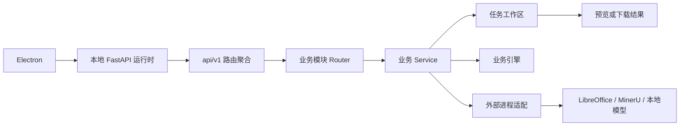

# 后端结构调整模块开发设计

> 本文档针对工具盒子项目的后端结构调整技术模块，描述当前实现事实、目标结构、数据边界、API 兼容要求和分阶段实施方式。

---

## 1. 需求

### 1.1 模块目标

在不改变工具盒子现有用户流程和 API 契约的前提下，将后端从“横向分层 + `tools` 子目录 + `utils` 混用”的结构，调整为：

- `src` 布局的 Python 包；
- 按业务域组织的模块化单体；
- API、业务服务、任务存储和外部进程之间职责清晰；
- 共享能力使用有语义的模块，不继续扩展万能 `utils` 或 `common`；
- Electron 开发启动和 PyInstaller 打包入口拥有稳定、明确的包路径。

### 1.2 已确认的项目事实

- 后端源码现位于 `backend/src/toolbox_backend/`，开发入口为 `toolbox_backend.main:app`，由 Uvicorn 显式指定 `src` 搜索路径。
- Python 版本为 3.12，使用 FastAPI、Pydantic v2、Uvicorn 和 `pydantic-settings`。
- 项目没有数据库，转换结果、临时任务和模型缓存保存在本地文件系统。
- 前端依赖 `/api/v1/*` 路径、统一 `POST` 方法和 `{code, message, data}` 响应壳。
- 当前业务模块均归于 `modules/`；共享文件能力、日志、任务存储和外部进程分别位于语义明确的基础设施、核心能力和集成模块。
- Electron 开发入口和 PyInstaller 均直接使用 `toolbox_backend.main:app`；旧 `app` 包及兼容导出文件已移除。

### 1.3 功能需求

1. 保留现有工具能力、路由路径、请求字段、响应字段、错误码和本地任务生命周期。
2. 每个业务模块能够独立定位入口、请求/响应 Schema、业务流程和外部依赖。
3. 统一处理业务异常，减少每个路由重复编写相同的 `try/except`。
4. 统一任务目录、任务 ID、路径边界、元数据和过期清理规则。
5. 将 LibreOffice、MinerU 等外部进程调用从业务编排中隔离出来。
6. 保留 PDF 深度解析的进程池、模型下载的单任务限制和取消/中断状态；模型删除仅允许作用于受管理的用户数据目录，模型下载或业务任务使用期间拒绝删除。
7. 文档转换相关能力继续共享 Markdown 来源校验、表格归一化和 DOCX 渲染，但不放回万能工具目录。

### 1.4 非功能需求

- **兼容性**：第一阶段不改变公开 API 和现有用户数据目录约定。
- **安全性**：任务文件只能访问当前任务目录；上传、ZIP 解包、路径和输出文件名继续由服务端校验。
- **可靠性**：长任务必须保留明确状态、失败原因和可恢复动作；不得使用普通请求后台任务替代现有进程池。
- **可维护性**：业务模块之间只依赖公开服务、类型或事件边界，不导入其他模块的私有实现。
- **可打包性**：源码运行、Electron 开发运行和 PyInstaller frozen 运行使用同一套包入口语义。
- **隐私性**：用户文件继续本地处理，不新增云端存储或账号数据。

### 1.5 范围与非范围

**本次范围：**

- 后端目录、包布局、模块边界、异常边界、任务存储边界和启动/打包引用。
- 现有 API 的兼容性整理。
- 代码迁移所需的文档、导入和入口调整。

**明确不在本次结构调整范围：**

- 不新增数据库、数据库迁移链或长期文件管理能力。
- 不改变现有 API 路径、POST 方法、响应字段和错误码语义。
- 不替换 PDF、MinerU、LibreOffice、证件照等处理引擎。
- 不把本地服务改造成云服务，不新增账号、鉴权或远程存储。
- 不因为目录整齐而创建空的 `repositories`、`models`、`common`、`db` 或抽象基类。

### 1.6 验收标准

- 所有现有 `/api/v1/*` 路径在目标结构中仍可注册。
- `electron/main.ts`、`electron/dev-runner.js` 和 PyInstaller 入口不再依赖旧的业务包路径。
- API 层不重复映射同一种业务异常。
- Service 不直接负责 API 响应壳构造。
- 任务存储路径、模型缓存路径和清理行为保持兼容。
- 模块依赖方向满足“API → 模块服务 → 基础设施/外部集成”。
- 代码迁移完成后，项目结构文档和本设计文档能够准确定位每个后端模块。

### 1.7 当前实施状态

- **主要结构迁移已完成**：业务代码已归入 `modules/`，源码布局切换为 `src/toolbox_backend`，开发/打包入口已更新。
- **无兼容转发层**：旧 `app` 包、横向业务目录和迁移期间的 API、Schema、Service、Utils 兼容导出均已移除。
- **证件照模块职责已拆分**：模板规则、模型资源/生命周期、推理、渲染、任务元数据和用例编排分别位于 `modules/id_photo/` 的语义文件中。
- **API 与本地数据约定保持不变**：公开路径仍为 `/api/v1/*`，接口仍使用 POST；任务目录、模型缓存和现有元数据格式未迁移。
- **已完成的静态验证**：应用导入成功，OpenAPI 中证件照 4 条路由已注册；`compileall` 对后端源码和 PyInstaller 入口的语法编译通过。
- **未执行**：自动化功能测试、PyInstaller 构建及服务启动。

---

## 2. 该项目的模块结构与流程

### 2.1 迁移结果与模块边界

源码现位于 `backend/src/toolbox_backend/`，不存在旧 `backend/app/` 包。迁移前分散在横向目录的职责已按以下边界归位；旧路径兼容文件不保留：

| 迁移前位置 | 当前职责位置 | 当前状态 |
|---|---|---|
| `app/api/v1/tools/*` | `modules/*/router.py` | 业务路由由对应模块直接提供，旧工具路由目录已删除 |
| `app/schemas/tools/*` | `modules/*/schemas.py` | Schema 随业务模块组织，旧工具 Schema 目录已删除 |
| `app/services/tools/*` | `modules/*/service.py` | 业务流程随业务模块组织，旧工具 Service 目录已删除 |
| `app/utils/file.py`、`logger_config.py` | `infrastructure/files.py`、`core/logging.py` | 共享职责已移出 `utils`，旧目录已删除 |
| Markdown、LibreOffice、任务清理旧 Utils | `modules/markdown_document`、`integrations/libreoffice`、`infrastructure/task_storage` | 逻辑迁移完成，旧转发文件已删除 |
| `app/services/model_manager.py` | `modules/model_management/service.py`、`integrations/mineru.py` | 模型业务和 MinerU 运行时适配分离，旧入口已删除 |
| `app.main:app` | `toolbox_backend.main:app` | Electron 与 PyInstaller 均使用目标包路径 |

Settings API 仍位于 `api/v1/settings.py`，负责聚合 MinerU 和证件照两种模型的公开接口；具体管理逻辑由对应业务模块提供。

### 2.2 当前目标结构

```text
backend/
├── pyproject.toml
├── src/toolbox_backend/
│   ├── main.py
│   ├── lifecycle.py
│   ├── api/
│   │   ├── router.py
│   │   ├── exception_handlers.py
│   │   └── v1/{router.py,health.py,settings.py}
│   ├── core/{config.py,errors.py,logging.py,capabilities.py}
│   ├── infrastructure/
│   │   ├── files.py
│   │   └── task_storage/{workspace.py,cleanup.py}
│   ├── integrations/{libreoffice.py,mineru.py}
│   ├── schemas/{response.py,settings.py}
│   └── modules/
│       ├── tool_catalog/
│       ├── model_management/
│       ├── pdf_to_markdown/
│       ├── pdf_to_word/
│       ├── markdown_document/
│       ├── markdown_to_word/
│       ├── markdown_to_pdf/
│       ├── epub_to_markdown/
│       ├── word_to_pdf/
│       ├── image_converter/
│       ├── id_photo/
│       └── qr_code/
├── packaging/
├── resources/
└── scripts/
```

Python 源码使用隐式命名空间包，不新增 `__init__.py`。Electron 的 Uvicorn 命令显式指定 `--app-dir <backend>/src`，PyInstaller spec 显式将 `backend/src` 加入源码搜索路径；没有运行时旧包别名或兼容入口。

### 2.3 目标模块职责

| 模块 | 负责内容 | 不负责内容 |
|---|---|---|
| `api` | API 版本聚合、路由注册、异常映射和统一响应 | 业务规则、文件转换和任务提交 |
| `core` | 配置、错误类型、日志、能力状态和应用生命周期支撑 | 具体工具业务 |
| `infrastructure/task_storage` | 任务工作区、路径边界、元数据文件和过期清理 | 决定某个工具如何转换文件 |
| `integrations/libreoffice` | LibreOffice 命令、profile、超时和输出检查 | 决定 Markdown 或 Word 的业务流程 |
| `integrations/mineru` | MinerU 命令、环境变量和模型运行时适配 | 模型下载页面业务和 PDF API |
| `modules/tool_catalog` | 工具目录、能力状态和入口可用性 | 执行具体转换 |
| `modules/model_management` | MinerU 模型状态、下载、取消、中断恢复和受管理缓存删除 | 处理用户业务文件 |
| `modules/id_photo` | 证件照处理、模型状态和默认用户数据目录资源的受限删除 | 删除应用资源或其他自定义路径上的文件 |
| `modules/pdf_to_markdown` | 标准/深度 PDF 解析、预览、进度和下载编排 | MinerU 模型下载 |
| `modules/markdown_document` | Markdown 来源、ZIP 安全、表格归一化和 DOCX 渲染 | HTTP 路由和任务页面状态 |
| 其他工具模块 | 各自的请求、业务规则、引擎调用和结果交付 | 访问其他模块的私有实现 |

证件照模块进一步按实际职责拆分为模板规则、人脸/抠图推理、图像渲染、任务元数据和用例 Service；二维码等简单模块不强行拆成更多层。

### 2.4 依赖方向

```text
Electron / Uvicorn
        ↓
   toolbox_backend.main
        ↓
      api/v1/router
        ↓
  modules/*/router.py
        ↓
  modules/*/service.py
        ↓
任务存储 / 业务引擎 / integrations
        ↓
本地文件系统 / LibreOffice / MinerU / 本地模型
```

必须遵守：

1. `api` 不直接读写任务文件，不调用第三方转换库完成业务流程。
2. `core` 和 `infrastructure` 不依赖具体业务模块。
3. 模块之间通过公开 Service、数据类型或能力注册表协作。
4. `schemas.py` 只做输入输出结构校验，不执行文件读取、模型检查或外部调用。
5. Service 返回业务数据或抛出项目业务异常，不返回最外层 `ApiResponse`。
6. 任务存储层负责路径边界和生命周期，但不提交业务事务或决定业务状态。
7. 由于当前没有数据库，不创建 Repository 层或通用 ORM 抽象。

### 2.5 核心流程



典型转换流程保持为：

1. API 接收 Multipart 或 Pydantic Request Schema。
2. 业务 Service 校验文件实际内容、大小、格式和业务参数。
3. Task Storage 创建隔离工作区并生成任务 ID。
4. Service 调用业务引擎或外部集成。
5. 结果写入当前任务目录，长任务同步状态文件。
6. API 返回统一业务响应，或返回 `FileResponse`。
7. 启动生命周期和定期清理逻辑删除过期任务。

### 2.6 分阶段实施

#### P0：边界基础设施（完成）

- 统一业务异常、全局异常处理、API 总路由和 v1 路由聚合。
- 将启动检测与能力状态从应用入口中分离。
- 业务代码统一使用 `core.errors.ServiceException`；旧异常转发文件已移除。

#### P1：共享能力整理（完成）

- 任务目录、任务 ID、路径边界和清理统一到 `infrastructure/task_storage`。
- LibreOffice 进程调用移入 `integrations/libreoffice.py`。
- Markdown 来源、表格、统计和 DOCX 渲染集中在 `modules/markdown_document`。
- 文件和日志能力移至 `infrastructure/files.py`、`core/logging.py`；旧 `utils` 转发文件已删除。

#### P2：业务模块归位（完成）

- 所有工具均按业务域放入 `modules/<domain>/`，包含其 Router、Schema 和 Service；EPUB Helper、PDF 深度解析及结果处理也归入对应模块。
- 证件照职责已分别放入 `model_management.py`、`model_resources.py`、`inference.py`、`templates.py`、`rendering.py`、`task_metadata.py` 和 `service.py`。
- MinerU 模型管理位于 `modules/model_management/service.py`，运行时适配位于 `integrations/mineru.py`。
- Settings API 保留在 `api/v1/settings.py`，因为它聚合 MinerU 与证件照两种模型的公开状态和操作。
- 旧 `api/v1/tools`、`schemas/tools`、`services/tools` 与迁移期兼容导出均已移除，路由聚合直接注册业务模块 Router。

#### P3：`src` 和运行入口迁移（完成）

- 后端源码位于 `src/toolbox_backend/`，使用隐式命名空间包，不增加 `__init__.py`。
- Electron 开发启动通过 Uvicorn `--app-dir <backend>/src` 导入 `toolbox_backend.main:app`。
- PyInstaller `pathex` 显式包含 `backend/src`；打包入口导入 `toolbox_backend.main:app`。
- 项目结构文档已更新；不保留 `app` 包名或兼容启动入口。

**验证记录**：已导入 FastAPI 应用并确认 OpenAPI 注册证件照 4 条路由；对 `backend/src/toolbox_backend/` 与 `backend/packaging/server.py` 执行 `compileall` 成功。未运行自动化功能测试、构建或启动。

### 2.7 回滚原则

- 不保留运行时兼容转发；如迁移失败，通过回退本次结构变更恢复，而不是新增旧路径别名。
- 不改变任务目录、模型目录及元数据格式，避免已有任务结果无法下载。
- 结构迁移不触碰用户数据，回滚仅涉及代码和配置文件。

---

## 3. 数据库的设计

### 3.1 数据库结论

本模块不使用数据库。当前项目没有 SQLAlchemy、SQLite、MySQL 或其他数据库连接；结构调整不新增数据库表、数据库会话、迁移链或 Repository 层。

### 3.2 本地数据边界

| 数据类型 | 当前位置 | 责任模块 | 生命周期 |
|---|---|---|---|
| 临时任务输入、输出和中间文件 | `settings.data_root/temp/tasks/<task_id>/` | `infrastructure/task_storage` | 默认约 24 小时，启动时清理 |
| 上传文件残留 | `settings.data_root/temp/uploads/` | `infrastructure/task_storage` | 按统一清理规则删除 |
| MinerU 模型缓存 | `settings.mineru_model_path` | `modules/model_management` + `integrations/mineru` | 用户数据目录长期保留，除非用户或安装流程处理 |
| 证件照模型资源 | 应用资源、显式配置路径或用户数据目录默认位置 | `modules/id_photo` | 设置页展示状态和位置；仅默认受管理的用户数据目录可删除，内置或其他自定义路径受保护；删除后需手动重新准备 |
| 二维码结果 | 当前请求内存和前端页面内存 | `modules/qr_code` | 不写入任务目录，页面关闭或重新生成后丢失 |

### 3.3 任务工作区约束

- `task_id` 保持当前 12 位十六进制格式。
- 所有任务路径必须由 Task Storage 根据任务 ID生成，不能直接拼接用户输入路径。
- 下载、预览和重新渲染只能访问当前任务目录内的允许文件。
- ZIP 解包继续限制条目数、展开大小、符号链接和路径穿越。
- 元数据文件、进度文件和输出文件名保持现有兼容格式，结构迁移不触发数据迁移。

### 3.4 并发与恢复

- 同一任务的结果写入使用临时文件后原子替换，避免下载读取半成品。
- MinerU 深度解析继续使用单工作进程队列，避免多个任务重复加载大模型。
- MinerU 模型下载继续限制为单个活动任务，并通过状态文件恢复“上次下载中断”的可见状态。
- 任务清理由生命周期或清理服务执行，不由 API 路由分散实现。
- 当前没有长期数据备份、跨设备同步和数据库恢复要求。

### 3.5 隐私与删除责任

后端只承担临时任务文件和模型缓存的本地生命周期；不建立用户文件库。临时任务过期清理由 Task Storage 负责；模型资源通过设置页显式管理和删除，删除仅限受管理的用户数据目录，不在业务转换接口中隐式执行。证件照模型没有设置页内下载/恢复入口，删除后需手动重新准备资源。

---

## 4. API 接口的设计

### 4.1 兼容原则

结构调整只改变代码组织，不改变以下公开契约：

- API 前缀：`/api/v1`。
- 所有接口使用 `POST`。
- JSON 接口使用 Pydantic Request Schema 和 `response_model`。
- 普通响应使用 `{code, message, data}`。
- 业务成功和失败继续使用项目统一的 `success()` / `error()` 语义。
- 下载成功返回 `FileResponse`；下载失败返回统一 JSON 错误响应。
- 现有业务错误码保持不变。
- 第一阶段继续兼容当前 HTTP 状态表达，不在结构迁移中同时改变前端依赖的状态码语义。

### 4.2 API 模块划分

| 目标模块 | API 路径 | 方法 | 请求边界 | 成功结果 |
|---|---|---|---|---|
| 健康检查 | `/api/v1/health` | POST | 无业务参数 | `ApiResponse`，状态为 `ok` |
| 工具目录 | `/api/v1/tools/list` | POST | 无业务参数 | `ApiResponse[GetToolListResponse]` |
| PDF 转 Markdown | `/api/v1/tools/pdf-to-markdown/convert` | POST | Multipart：PDF、`deep_parse` | `ConvertResponse` |
| PDF 转 Markdown | `/progress`、`/preview`、`/download` | POST | `GetProgressRequest`、`GetPreviewRequest`、`DownloadRequest` | 进度、预览或文件下载 |
| PDF 转 Word | `/api/v1/tools/pdf-to-word/convert`、`/download` | POST | Multipart 或 `DownloadRequest` | `ConvertResponse` 或 DOCX 下载 |
| Markdown 转 Word | `/api/v1/tools/markdown-to-word/convert`、`/download` | POST | Multipart/Form 或 `DownloadRequest` | `ConvertResponse` 或 DOC/DOCX 下载 |
| Markdown 转 PDF | `/api/v1/tools/markdown-to-pdf/convert`、`/download` | POST | Multipart/Form 或 `DownloadRequest` | `ConvertResponse` 或 PDF 下载 |
| EPUB 转 Markdown | `/api/v1/tools/epub-to-markdown/convert`、`/preview`、`/download` | POST | Multipart 或 `GetPreviewRequest` | 转换结果、预览或 ZIP 下载 |
| Word 转 PDF | `/api/v1/tools/word-to-pdf/convert`、`/download` | POST | Multipart 或 `DownloadRequest` | 转换结果或 PDF 下载 |
| 图片转换 | `/api/v1/tools/image-converter/convert`、`/download`、`/download-all` | POST | Multipart 或下载 Request Schema | 文件清单或文件/ZIP 下载 |
| 证件照 | `/api/v1/tools/id-photo/templates`、`/process`、`/render`、`/download` | POST | Multipart 或 Pydantic Request Schema | 模板、处理结果或图片下载 |
| 二维码 | `/api/v1/tools/qr-code/generate` | POST | Multipart：文本或文件 | `GenerateResponse` |
| 模型管理 | `/api/v1/settings/models/status`、`/download`、`/progress`、`/cancel`、`/delete` | POST | `ModelRequest` 的 `model_id` 为 `mineru-pipeline` 或 `id-photo`；状态查询可不带参数 | `ModelStatusResponse` / `ModelActionResponse`，含 `status`、`source`、`path`、`can_delete`、`delete_reason`；MinerU 状态包含 `not_downloaded`、`downloading`、`ready`、`failed`、`interrupted`、`cancelled`，证件照状态包含 `not_downloaded`、`ready`、`incomplete`、`unavailable`；仅 MinerU 支持下载/取消，删除受管理目录内的模型 |

路由前缀由 `api/v1/router.py` 统一管理，具体模块路由只声明相对路径，避免当前 `health.py`、`tools/list.py` 与其他路由混用完整路径和 `prefix` 的问题。

### 4.3 API 与 Service 边界

```text
Request Schema / UploadFile / Form
              ↓
       module/router.py
              ↓  参数转换
       module/service.py
              ↓
业务类型、Task Workspace、业务引擎和外部集成
              ↓
        业务结果或业务异常
              ↓
统一响应封装 / FileResponse
```

- Router 负责 FastAPI 参数声明、调用 Service、选择 JSON 或文件响应。
- Service 不构造最外层 `ApiResponse`，不处理 HTTP 状态，也不依赖其他模块的 Router。
- API 异常处理器统一把业务异常映射为项目错误码和公开消息。
- 具体模块可以保留业务专用错误，但不能把 `HTTPException` 下沉到 Service。
- 第三方异常、文件系统异常和进程异常必须在集成或 Service 边界转换为安全的公开错误，不返回堆栈、命令行、内部路径或原始供应商输出。

### 4.4 参数和校验规则

- JSON Body 使用现有或新增的 Pydantic Request Schema，禁止使用无约束 `dict`。
- Multipart 文件继续由 API 层接收，由 Service 校验实际格式、大小、内容和像素限制。
- `task_id`、文件索引和模型 ID 在 Request Schema 中完成格式和范围校验；任务是否存在和是否处于允许状态由 Service 判断。
- 列表和状态查询仍使用 POST；当前没有分页需求，不新增分页结构。
- 如未来增加筛选或分页，必须使用 POST Request Schema，并遵循项目规定的 `lists` / `pagination` 结构。

### 4.5 异常、并发和取消

- `ServiceException` 迁移为核心业务异常类型，保留现有 `code` 和公开 `message` 字段的兼容语义。
- 路由删除重复的 `try/except ServiceException`，统一由应用异常处理器映射。
- 只有需要补充响应头、清理局部资源或改变控制流的路由才局部捕获异常。
- PDF 深度解析的提交、进度查询和失败状态继续通过任务目录状态文件传递。
- 模型下载的重复提交继续复用活动任务；取消只改变任务状态并终止对应进程。
- 删除操作由设置页显式发起并经过用户二次确认；仅允许删除默认受管理的用户数据模型目录，MinerU 下载或深度解析排队/运行、证件照处理运行中均拒绝删除。
- 当前结构调整不新增 SSE、WebSocket 或外部任务队列。

### 4.6 桌面端和打包调用边界

开发入口通过 Uvicorn 显式指定源码目录；打包入口导入同一目标包：

```text
当前开发：uvicorn toolbox_backend.main:app --app-dir <backend>/src
当前打包：packaging/server.py 导入 toolbox_backend.main:app
```

Electron 仍通过 `POST /api/v1/health` 判断后端是否真正就绪。PyInstaller spec 的 `pathex` 包含 `backend/src`，开发入口与打包入口不依赖旧 `app` 包或兼容转发。

### 4.7 结构调整验收

1. 前端现有 API 调用无需修改路径和方法。
2. 所有 JSON 响应仍符合 `{code, message, data}`。
3. 下载接口仍能区分文件响应和 JSON 错误响应。
4. API 路由只依赖对应业务模块的公开 Service。
5. `main.py` 不再逐个导入所有业务实现并直接修改业务全局状态。
6. 异常映射集中且不会泄露内部堆栈、路径、命令或模型输出。
7. Electron 开发启动、PyInstaller 入口和资源路径均使用 `src/toolbox_backend` 布局，旧 `app` 入口不存在。
8. 应用导入、证件照路由注册和 Python 语法编译已验证；自动化功能测试、构建和启动尚未执行。
