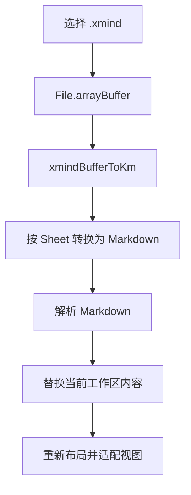
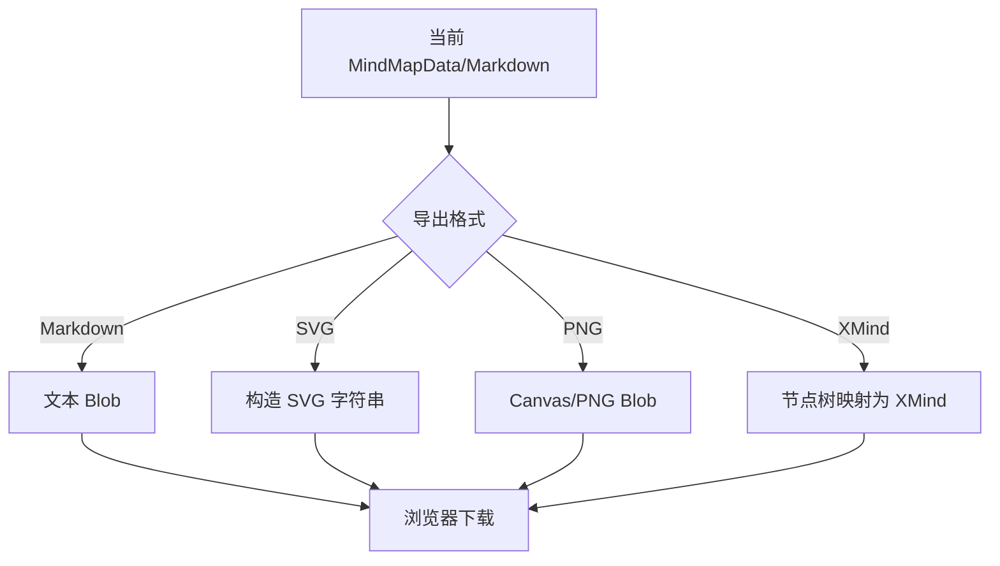

# 思维导图模块开发设计

> 本文档针对“工具盒子”中的思维导图模块，描述将 `/Users/mima1234/Desktop/code/mindmap` 的 React 思维导图能力迁移为当前项目 Vue 3 原生实现后的需求、项目内结构与流程、数据库和 API 设计。
>
> **当前进度：纯 TypeScript 核心迁移已完成，Vue 工作区、只读渲染、Markdown 编辑器、基础节点交互和 Markdown/SVG/PNG 导出迁移进行中。**
>
> | 阶段 | 进度 |
> | --- | --- |
> | 项目事实和源项目能力梳理 | 已完成 |
> | Vue 原生迁移设计 | 已完成 |
> | 行为基线整理 | 已完成 |
> | 纯 TypeScript 核心迁移 | 已完成 |
> | Vue 工作区与只读渲染迁移 | 进行中 |
> | Markdown 编辑器迁移 | 进行中 |
> | Vue 节点编辑与交互迁移 | 进行中 |
> | XMind 导入/导出适配 | 未开始 |
> | 工具目录与路由接入 | 进行中 |
> | 核心单元测试 | 已完成，80 项通过 |
> | 组件测试、E2E、构建和打包验证 | 未开始 |

---

## 1. 需求

### 1.1 已确认的项目事实

| 事项 | 当前项目事实 |
| --- | --- |
| 应用形态 | Electron 承载 Vue 3 + TypeScript 前端，并启动本地 FastAPI 服务。 |
| 前端版本 | Vue 3.5.13、TypeScript 5.7、Vite 6.3、Tailwind CSS 4.1。 |
| 前端界面约定 | 页面使用 `<script setup lang="ts">`，图标使用 FontAwesome 6，工具页面通过动态路由加载。 |
| 工具目录 | `backend/app/services/tools/list.py` 返回工具元数据；`frontend/src/router/tools.ts` 合并后端条目和本地组件注册表。 |
| API 契约 | HTTP 接口统一使用 POST，JSON 响应使用 `{code, message, data}`。 |
| 桌面安全边界 | Electron Renderer 使用 `contextIsolation: true`、`nodeIntegration: false`；现有 Preload 只暴露窗口控制、应用信息和更新能力。 |
| 当前文件工具模式 | 前端通常使用浏览器 `File`、`Blob`、文件输入和下载链接完成文件交互；不要求每个工具新增 Electron IPC。 |
| 当前数据层 | 工具盒子没有用户文档数据库；文件工具按功能选择内存或临时任务目录保存数据。 |
| mindmap 来源项目 | `/Users/mima1234/Desktop/code/mindmap` 是 React 19 + TypeScript 的 SVG 思维导图项目，包含公共组件、Markdown 解析、布局、插件、编辑交互和桌面工作区。 |
| mindmap 公共能力 | `MindMap` 支持 Markdown/数据输入、节点编辑、布局、缩放、历史、标签、插件、SVG/PNG 导出和命令式操作；相关纯函数和类型可脱离 React 迁移。 |
| mindmap 桌面能力 | 桌面工作区额外提供 Markdown 编辑、XMind 8/2020 导入、XMind 导出、SVG 导出和高清 PNG 导出。 |
| XMind 解析能力 | `@ljheee/xmind-parser` 的 `xmindBufferToKm`、`kmToXmindBuffer` 支持浏览器端 `ArrayBuffer`。 |
| 用户范围确认 | 首版按完整工具设计，包含 XMind 导入/导出；不接入 mindmap 网页演示中的 AI 生成功能。 |

### 1.2 模块目标

在工具盒子中新增一个“思维导图”工具，将 mindmap 的核心能力迁移为 Vue 原生模块：用户可以编辑 Markdown 大纲，实时查看 SVG 思维导图，直接编辑节点，并在本地导入/导出 Markdown、XMind、SVG 和 PNG 文件。

迁移后的模块不引入 React，不嵌入独立网页，不启动第二个 Electron 窗口，也不通过后端上传或处理用户思维导图内容。

### 1.3 功能需求

1. **Markdown 工作区**
   - 提供带语法高亮的 Markdown 大纲编辑器。
   - 支持根节点、多根节点、层级缩进和 mindmap 已有扩展语法。
   - 编辑文本后实时更新思维导图。
   - 支持重置示例、重新导入和当前文件名展示。
   - 保留编辑器撤销、重做、粘贴和输入法组合输入行为。

2. **思维导图渲染**
   - 使用 SVG 绘制节点、连接线、标签、任务状态、备注提示、图片占位和公式。
   - 支持浅色、深色和自动主题。
   - 支持向左、向右和两侧展开布局。
   - 支持画布平移、缩放、自动适配和键盘快捷键。
   - 支持节点折叠、标签筛选和相关分支弱化。

3. **节点编辑**
   - 支持节点文本编辑、增加子节点、增加同级节点和删除节点。
   - 支持同级排序、跨侧移动和拖拽调整层级。
   - 节点结构变化后同步序列化为 Markdown。
   - 保持节点编辑、拖拽和文本编辑之间的历史记录一致。

4. **扩展语法和插件**
   - 迁移任务状态、备注、多行内容、标签、折叠、虚线、交叉链接、frontmatter 和 LaTeX 等现有插件。
   - 插件继续参与解析、布局、节点渲染、连接线和导出流程。
   - 新模块不新增 AI 插件，不接入插件市场或远程插件加载。

5. **文件导入**
   - 支持 `.md`、`.markdown`、`.txt` 文件导入。
   - 支持 `.xmind` 文件导入，兼容 XMind 8/XML 与 XMind 2020+/JSON。
   - 多 Sheet 按 Sheet 名称转换为可编辑的 Markdown 分组。
   - 导入失败时保留当前内容，不清空工作区。
   - 文件大小、空文件和解析失败需要给出可理解的错误信息。

6. **文件导出**
   - 导出当前 Markdown 文本。
   - 导出当前地图为 SVG。
   - 导出当前地图为 PNG，支持 2x、3x、4x 倍率。
   - 导出当前节点树为 XMind 2020+ 文件。
   - 导出文件名根据根节点或当前文件名生成，并移除路径字符和不安全字符。
   - 导出失败或用户取消时不改变当前编辑内容。

7. **工具目录集成**
   - 首页和侧边栏展示“思维导图”工具。
   - 通过现有动态工具路由进入 `/tools/mindmap`。
   - 工具可用性由固定的前端能力和后端工具元数据共同决定；不依赖 LibreOffice、MinerU 或证件照模型。

### 1.4 非功能需求

- **Vue 原生**：业务组件全部使用 Vue 3 SFC 和 TypeScript，不新增 React、ReactDOM 或 iframe。
- **本地优先**：Markdown、XMind 和导出内容只在当前 Renderer 内处理；不上传到 FastAPI 或外部服务。
- **性能**：节点树和布局结果按不可变数据替换，使用 `shallowRef` 避免大型树的深层响应式代理；布局和导出以实际测量结果为准进行优化。
- **安全**：不执行 Markdown 中的 HTML 或脚本；链接协议、图片地址和公式 SVG 需要经过安全过滤；公式和编辑器高亮禁止直接信任用户原始 HTML。
- **可访问性**：控制按钮使用语义化 `button`，提供键盘操作、可见焦点、`aria-label`、折叠状态和处理中状态播报。
- **可维护性**：纯 TypeScript 算法、Vue 组件、Composable、XMind 适配器和工具页面分层，不把所有状态集中在一个 Vue 文件中。
- **兼容性**：保持 mindmap 现有 Markdown 语义和导出行为；Vue 迁移不主动修改语法规则。
- **许可证**：移植 mindmap 项目代码时保留 Apache-2.0 许可声明；使用 `@ljheee/xmind-parser` 时保留其 MIT 许可要求。

### 1.5 当前范围、范围外事项与职责边界

**当前范围**：Vue 原生思维导图核心、Markdown 编辑和解析、SVG 渲染、节点交互、插件语法、XMind 导入/导出、Markdown/SVG/PNG 导出、工具目录接入、单元测试和关键 E2E 验收。

**明确不做**：

- 不接入网页演示中的 AI 生成、外部模型、SSE 或 API Key 配置。
- 不新增用户账号、云同步、在线文档库或历史文档数据库。
- 不通过 FastAPI 接收或转换思维导图文件。
- 不复制 mindmap 的 Landing、Docs、Live 网页页面和独立 Electron 桌面壳。
- 不默认新增原生文件保存对话框和应用菜单；首版沿用当前工具盒子的文件输入和浏览器下载模式。
- 不在本次迁移中改变 mindmap 的 Markdown 语法、插件语义或 XMind 映射规则。

**职责边界**：

- `frontend/src/features/mindmap/core` 负责解析、树操作、布局、主题、历史和导出算法，不依赖 Vue。
- `frontend/src/features/mindmap/components` 负责 SVG、编辑器、控制栏、菜单和提示展示。
- `frontend/src/features/mindmap/composables` 负责状态、交互、生命周期、拖拽、平移和缩放。
- `frontend/src/features/mindmap/adapters/xmind` 负责 XMind 与 Markdown/节点树之间的转换，不负责通用地图渲染。
- `frontend/src/views/tools/MindMap.vue` 负责工具页面布局、文件选择、导出触发、工作区状态和错误反馈。
- `backend/app/services/tools/list.py` 只负责提供工具目录元数据，不负责思维导图业务处理。
- Electron Main/Preload 不负责思维导图内容处理；只有未来要求原生保存对话框时，才另行扩展 IPC。

### 1.6 可观察的验收标准

> 以下为完整迁移后的目标验收标准，不代表当前阶段已全部实现；当前实现状态以第 2.8.6 节和第 2.9 节为准。

1. 首页、侧边栏和 `/tools/mindmap` 路由均能进入思维导图工具。
2. Markdown 编辑器修改层级后，地图节点和连接线实时更新。
3. 节点编辑、增加、删除、拖拽和排序能够同步回 Markdown。
4. 撤销、重做、折叠、标签筛选、布局方向、缩放和平移行为可用。
5. 任务状态、备注、标签、链接、折叠、虚线、交叉链接和公式能够按既有语义显示。
6. XMind 8 与 XMind 2020+ 文件可以导入；多 Sheet 能保留可识别的分组结构。
7. Markdown、SVG、PNG 和 XMind 文件能够下载；PNG 倍率会影响实际像素尺寸。
8. 错误 XMind、空 Markdown、超大文件和导出失败时不丢失当前内容，并显示恢复方式。
9. 模块不向 FastAPI、AI 服务或其他外部服务发送思维导图内容。
10. Vue 类型检查、核心单元测试、思维导图工具 E2E 和前端生产构建能够完成。

---

## 2. 该项目的模块结构与流程

### 2.1 在当前项目中的位置

当前项目使用“后端工具目录 + 前端本地组件注册 + Vue 动态路由”的工具组织方式。思维导图是一个以浏览器端内存和文件 API 为主的前端工具，不新增后端业务 Router。

| 设计位置 | 计划职责 |
| --- | --- |
| `frontend/src/features/mindmap/core/` | 迁移 mindmap 的类型、Markdown、树操作、布局、内联解析、主题、历史和导出纯函数。 |
| `frontend/src/features/mindmap/plugins/` | 迁移插件类型、插件运行器和内置插件。 |
| `frontend/src/features/mindmap/composables/` | 将 React Hook 改写为 Vue Composable，管理地图状态、视图、拖拽、编辑、主题和动画。 |
| `frontend/src/features/mindmap/components/` | 使用 Vue SFC 重写地图、Canvas、节点、控制栏、上下文菜单、导入对话框和文本编辑器。 |
| `frontend/src/features/mindmap/adapters/xmind/` | 迁移 XMind Sheet 与 Markdown、MindMapData 之间的转换和公式恢复逻辑。 |
| `frontend/src/features/mindmap/styles/mindmap.css` | 迁移带 `mindmap-` 前缀的核心 SVG、节点、浮层和编辑器样式。 |
| `frontend/src/views/tools/MindMap.vue` | 组织工具盒子的工作区、文件导入、导出、错误和状态展示。 |
| `frontend/src/router/tools.ts` | 注册本地页面组件并生成 `/tools/mindmap` 路由。 |
| `backend/app/services/tools/list.py` | 增加思维导图工具目录条目，使首页和侧边栏能够发现该工具。 |
| `frontend/tests/mindmap.spec.ts` | 验证工具入口、编辑、导入、导出和主要交互。 |

### 2.2 项目级模块关系

```mermaid
flowchart LR
    User[用户] --> Shell[Electron 工具盒子外壳]
    Shell --> Vue[Vue 工具页面]
    Vue --> Registry[工具注册与动态路由]
    Vue --> Workspace[思维导图工作区]
    Workspace --> Editor[Markdown 编辑器]
    Workspace --> Core[思维导图核心]
    Core --> Parser[Markdown 与插件解析]
    Core --> Layout[布局与 SVG 渲染]
    Core --> Export[SVG/PNG/Markdown 导出]
    Workspace --> XMind[XMind 适配器]
    XMind --> ParserLib[@ljheee/xmind-parser]
    Registry -. 元数据 .-> ToolList[FastAPI 工具列表接口]
```

### 2.3 Vue 模块内部结构

#### 2.3.1 纯 TypeScript 核心

以下能力从 mindmap 源项目移植时不依赖 React：

- `MindMapData`、`LayoutNode`、`Edge`、任务状态、方向和主题类型；
- Markdown 多根解析、序列化和 frontmatter；
- 节点增删改、移动、排序、ID 重建和历史快照；
- 节点尺寸测量、树布局、连接线路径和标签筛选；
- 行内 Markdown Token、文本宽度估算和导出 SVG 结构；
- 主题颜色、国际化消息和插件执行链；
- SVG/PNG 导出准备、公式尺寸和外部内容校验。

这些模块保留纯函数边界，方便直接迁移 mindmap 原有单元测试。

#### 2.3.2 Vue 组件和 Composable

| Vue 层 | 主要职责 |
| --- | --- |
| `MindMap.vue` | 组合输入解析、地图状态、视图状态、事件、历史、导出和 `defineExpose` API。 |
| `MindMapCanvas.vue` | 渲染 SVG 画布、连接线、节点、拖拽临时层和插件覆盖层。 |
| `MindMapNode.vue` | 渲染节点文本、任务状态、标签、备注、图片、公式、折叠按钮和编辑态。 |
| `MindMapControls.vue` | 提供缩放、适配、历史、标签、文本模式、方向和全屏等操作。 |
| `MindMapTextEditor.vue` | 基于 `contenteditable` 实现高亮、光标恢复、撤销、重做、粘贴和组合输入。 |
| `MindMapContextMenu.vue` | 提供节点操作、布局菜单、键盘导航和 Markdown/SVG/PNG 导出；文件导入与 XMind 菜单待后续接入。 |
| `useMindMapState.ts` | 管理 `MindMapData[]`、选中节点、历史、折叠和受控 Markdown。 |
| `useMindMapView.ts` | 组合布局、主题、标签筛选、缩放、平移、适配和动画。 |
| `useMindMapDrag.ts` | 处理节点拖拽、同级排序和跨侧移动。 |
| `useNodeEdit.ts` | 管理节点编辑、提交、取消和任务状态变化。 |
| `useCanvasPan.ts` | 管理画布平移、缩放边界和触控手势。 |

不把所有逻辑集中到 Pinia；该模块只在当前工具页面内使用，局部状态优先使用 `ref`/`shallowRef`，跨组件共享由 Composable 负责。

#### 2.3.3 当前实现与目标结构差异

上表描述的是完整迁移后的目标结构，不等同于当前已落地目录。当前实现状态如下：

- `MindMap.vue` 当前是编辑器与地图查看器的工作区包装，地图状态、历史、拖拽、右键菜单和基础导出仍主要由 `MindMapViewer.vue` 管理。
- `composables/`、`adapters/xmind/` 和独立 `MindMapControls.vue` 当前尚未建立；相关职责暂由查看器和核心纯函数承载。
- `MindMapContextMenu.vue` 当前已支持节点操作、复制粘贴、布局切换和 Markdown/SVG/PNG 导出；文件导入与 XMind 操作尚未接入。
- `views/tools/MindMap.vue` 已作为正式工具页面加入本地注册表和后端工具目录；基础组件 API 已接入，PNG 倍率参数、完整标签筛选、XMind API 和更完整的文件工作流仍待接入。

### 2.4 React 到 Vue 的迁移映射

| mindmap React 实现 | 当前项目 Vue 设计 |
| --- | --- |
| `MindMap.tsx` | `MindMap.vue` + `useMindMapState` + `useMindMapView` |
| `MindMapViewer.tsx` | `MindMapViewer.vue` |
| `MindMapNode.tsx` | `MindMapNode.vue` |
| `MindMapCanvas.tsx` | `MindMapCanvas.vue` |
| `MindMapControls.tsx` | `MindMapControls.vue` |
| `MindMapTextEditor.tsx` | `MindMapTextEditor.vue`，保留直接 DOM 操作以维护光标 |
| React Hook | Vue Composable、`watch`、`onMounted`、`onBeforeUnmount` |
| `forwardRef/useImperativeHandle` | `defineExpose` |
| Props 回调 | `defineProps` + `defineEmits` |
| React lazy 组件 | Vue 条件渲染或动态导入 |
| 内部 lucide 图标 | 当前项目 FontAwesome 图标体系；地图内部几何图标仍使用 SVG |
| React CSS | 迁移为带 `mindmap-` 前缀的 CSS，并由思维导图入口统一加载 |

### 2.5 核心数据模型和状态

#### 2.5.1 节点数据

```text
MindMapData
├── id
├── text
├── children
├── remark
├── taskStatus
├── multiLineContent
├── tags
├── anchorId / crossLinks
├── dottedLine
├── collapsed
└── placeholder
```

`MindMapData[]` 是内容状态的唯一真相。节点布局位置、缩放、平移、筛选弱化和动画状态均属于视图状态，不写回 Markdown。

#### 2.5.2 状态边界

| 状态 | 保存位置 | 说明 |
| --- | --- | --- |
| 当前 Markdown | `views/tools/MindMap.vue` 与 `components/MindMap.vue` | 负责 Markdown 文件读取、编辑同步和基础导出；不持久化。 |
| 节点树 | `components/MindMapViewer.vue` 内部 `shallowRef` | 由 Markdown 解析或节点操作生成。 |
| 布局节点/连接线 | `computed` | 根据节点树、方向、主题和筛选状态计算。 |
| 缩放/平移 | `ref` | 只影响当前视图，不进入源文件。 |
| 历史快照 | `MindMapViewer.vue` 内存状态 | 页面离开、重新导入或外部 Markdown 替换后清空。 |
| 导出错误状态 | `MindMapViewer.vue` 局部状态 | 展示 Markdown、SVG、PNG 导出失败提示。 |
| 文件名 | `views/tools/MindMap.vue` 局部状态 | 只用于展示和建议下载名称。 |

### 2.6 主要业务流程

#### 2.6.1 Markdown 编辑到地图

```mermaid
flowchart TD
    Input[Markdown 输入或文件导入] --> Editor[MindMapTextEditor.vue]
    Editor --> Parse[Markdown/插件解析]
    Parse --> Tree[MindMapData[]]
    Tree --> Layout[布局计算]
    Layout --> SVG[Vue SVG 组件]
    SVG --> View[缩放/平移/折叠/标签筛选]
```

1. `views/tools/MindMap.vue` 初始化默认 Markdown，或读取用户选择/拖放的 `.md`、`.markdown` 文件。
2. `components/MindMap.vue` 通过受控 `markdown` Prop 将内容传给 `MindMapViewer.vue`。
3. `MindMapViewer.vue` 解析 Markdown，生成节点树和 frontmatter 视图选项。
4. 查看器根据节点树、方向、主题和插件计算布局节点与连接线，由 `MindMapCanvas.vue` 使用 SVG 绘制地图。
5. 文本编辑或节点操作通过 `markdownChange` 同步回工作区 Markdown，并触发重新解析。

#### 2.6.2 地图节点操作到 Markdown

```mermaid
flowchart LR
    NodeAction[节点编辑/新增/删除/拖拽] --> TreeOp[不可变树操作]
    TreeOp --> History[记录历史快照]
    TreeOp --> Data[更新 MindMapData[]]
    Data --> Serialize[toMarkdownMultiRoot]
    Serialize --> Editor[更新 Markdown 编辑器]
```

节点操作由 `MindMapViewer.vue` 调用 `tree-ops` 产生新节点树，并在查看器内部记录基础历史。查看器使用插件集合序列化为 Markdown，通过 `markdownChange` 传给 `MindMap.vue`，再更新 `MindMapTextEditor.vue`；同时通过 `dataChange` 转发当前节点树供外部调用。`dataChange` 不是 Markdown 同步主链路；视图状态不参与序列化。

#### 2.6.3 XMind 导入

当前尚未实现，以下为 XMind 适配器接入后的目标流程。



- 导入前校验扩展名、文件大小和空文件。
- 解析失败不替换当前 Markdown。
- 多 Sheet 按 Sheet 名称分组，并保留转换警告。
- 图片、附件、优先级和无法映射的 XMind 特性按既有转换规则提示警告。

#### 2.6.4 导出

当前已实现 Markdown、SVG、PNG 基础下载，入口位于基础右键菜单；XMind 导出和 PNG 倍率选择仍属于目标能力。



导出使用当前页面状态，不重新读取原始文件。导出过程失败时保留编辑器和地图状态。

### 2.7 安全与渲染边界

- Markdown 中的原始 HTML 不直接作为页面 HTML 执行。
- 链接只允许 `http`、`https`、`mailto`、`tel` 等明确协议；链接点击使用新窗口并阻止 SVG 节点事件冒泡。
- 编辑器高亮 HTML 必须由转义后的 Markdown 生成，不能把用户原文直接交给 `v-html`。
- MathJax 生成的公式 SVG 仅在移除外部资源、脚本、`foreignObject` 和不允许链接后插入；建议使用专用安全渲染指令或组件。
- XMind 只在内存中解析，生成的 XMind 只通过 Blob 下载，不把文件名当作路径使用。
- 日志不记录 Markdown 正文、文件内容或完整用户路径。

### 2.8 行为基线（已完成）

#### 2.8.1 基线来源

- 源项目：`/Users/mima1234/Desktop/code/mindmap`
- 基线分支：`main`
- 基线提交：`20e5b24ff6f7ee97702a92524fd5fae81584762e`
- 基线提交说明：`fix: repair XMind formula PNG export`
- 基线状态：源项目工作区无未提交变更。
- 基线原则：Vue 迁移必须保持下列 Markdown 语义、节点行为、导入导出结果和公式 PNG 导出行为；若确需改变，应先更新本设计文档和对应验收样例。

#### 2.8.2 已纳入基线的测试和实现入口

| 基线类别 | 源项目入口 | 迁移用途 |
| --- | --- | --- |
| Markdown 解析与序列化 | `src/components/MindMap/utils/markdown.test.ts`、`input.test.ts` | 验证单根、多根、任务状态、frontmatter、方向和主题解析。 |
| 树操作与历史 | `tree-ops.test.ts`、`history.test.ts` | 验证节点增删改、移动、排序、ID 重建、撤销和重做。 |
| 布局与标签 | `layout.test.ts`、`tag-filter.test.ts` | 验证方向、多根、折叠、节点位置、连接线和标签筛选。 |
| 行内内容 | `inline-markdown.test.ts`、`formula.test.ts` | 验证粗体、链接、图片、LaTeX、公式尺寸和安全 SVG。 |
| 导入与导出 | `import.test.ts`、`export.test.ts`、`public-api.test.ts` | 验证 JSON/Markdown 导入、SVG/PNG 导出和公共命令式 API。 |
| 用户流程 | `tests/e2e/mindmap.spec.ts` | 验证右键菜单、导入对话框、非法输入、Markdown 导入和撤销/重做。 |
| 桌面工作区 | `apps/desktop/src/renderer/DesktopApp.tsx` | 作为 Markdown/XMind 工作区、文件名、方向和导出操作的交互基线。 |
| XMind 转换 | `apps/desktop/src/shared/xmind-markdown.ts`、`xmind-export.ts`、`xmind-formula.ts` | 作为 XMind 8/2020、Sheet 分组、任务/标签/备注/公式映射的转换基线。 |

#### 2.8.3 验收样例矩阵

| 样例 | 输入/操作 | 预期结果 |
| --- | --- | --- |
| 基础层级 | 根节点、两级子节点、多个根节点 | 节点层级、根节点数量和 Markdown 序列化结果保持一致。 |
| 行内格式 | 粗体、斜体、删除线、代码、链接和图片 | SVG 节点按语义渲染；链接不会触发画布选中或拖拽。 |
| 扩展语法 | `[ ]`、`[-]`、`[x]`、`>`、多行、`#标签`、`+` 折叠 | 任务状态、备注、标签和初始折叠状态正确显示并可序列化。 |
| 关系和方向 | 虚线、锚点、交叉链接、左/右/双向布局 | 连接线样式、标签和节点方向正确，切换方向不丢失内容。 |
| 公式 | 行内公式、块级公式、多行公式、公式导出 | 预览可见，SVG 和不同 PNG 倍率导出不出现公式缺失或错位。 |
| 编辑操作 | 双击编辑、增加/删除节点、拖拽移动、右键菜单 | 节点树和 Markdown 同步更新；撤销/重做恢复完整状态。 |
| 视图操作 | 平移、缩放、适配、折叠、标签筛选 | 只改变视图状态，不改变 Markdown 内容；只读模式不产生选中副作用。 |
| Markdown 导入 | 导入有效 Markdown、空文件、非法层级或非法内容 | 有效内容替换工作区；失败时保留原内容并显示错误。 |
| XMind 导入 | XMind 8、XMind 2020+、多 Sheet、备注、标签和任务 | 转换为可编辑 Markdown，并显示无法映射的特性警告。 |
| 文件导出 | Markdown、SVG、PNG 2x/3x/4x、XMind | 文件可下载；文件名安全；PNG 倍率影响实际像素；XMind 可重新解析。 |

#### 2.8.4 基线结论

行为基线阶段已完成。纯 TypeScript 核心迁移已完成：已建立 `frontend/src/features/mindmap/core/`，移植核心算法和插件契约，复制 10 个核心测试文件；当前核心测试 80 项通过，Vue 类型检查通过。Vue 工作区、只读渲染、Markdown 编辑器、基础节点编辑/拖拽、基础右键菜单、Markdown 文件导入和 Markdown/SVG/PNG 导出已启动，XMind 和完整工具能力仍需继续迁移。

#### 2.8.5 迁移校正

源项目 `tag-filter.test.ts` 期望选中标签节点的后代保持可见，但源实现只保留节点自身和祖先，导致该基线测试失败。Vue 核心迁移中已补充后代上下文，当前迁移后的 80 项核心测试全部通过；该调整属于按既有测试契约修正行为，不改变标签筛选的公开语义。

#### 2.8.6 当前迁移产出

| 产出 | 当前状态 | 说明 |
| --- | --- | --- |
| 纯 TypeScript 核心 | 已完成 | 已迁移解析、布局、插件、主题、历史、公式和 SVG/PNG 核心逻辑。 |
| 核心测试 | 已完成 | 10 个测试文件、80 项测试通过。 |
| Vue 只读查看器 | 进行中 | 已有 SVG 画布、节点、连接线、缩放、平移、折叠和安全 SVG 边界，尚未完成浏览器 E2E。 |
| Markdown 编辑器 | 进行中 | 已有高亮、光标、撤销/重做、Tab、粘贴和 IME 处理，仍需与节点编辑历史联动。 |
| Vue 工作区 | 进行中 | 已有编辑器、地图预览和 Markdown 文件打开入口，并已注册到正式工具目录。 |
| 节点编辑与拖拽 | 进行中 | 已加入节点选择、双击改名、添加子节点、删除、同级交换、跨侧拖拽，以及支持节点操作、复制粘贴和布局切换的基础右键菜单；完整视图历史仍待迁移。 |
| XMind、导出和工具注册 | 进行中 | Markdown/SVG/PNG 已可从基础右键菜单导出，工具入口和基础组件 API 已接入；XMind、PNG 倍率选择和完整导出选项仍待接入。 |

### 2.9 实施顺序

| 优先级 | 任务 | 主要内容 | 工作量 | 当前进度 |
| --- | --- | --- | --- | --- |
| P0 | 行为基线 | 固定 mindmap 源项目提交、整理语法/交互/导出验收样例 | S | 已完成 |
| P0 | 核心移植 | 类型、Markdown、树操作、布局、插件、主题、导出和历史 | M | 已完成 |
| P0 | 只读渲染 | SVG Canvas、节点、连接线、主题、公式和适配视图 | M | 进行中 |
| P0 | 编辑交互 | 节点编辑、拖拽、右键菜单、折叠、标签和键盘快捷键 | L | 进行中（已完成基础节点编辑、拖拽重排、右键菜单、历史和快捷键） |
| P0 | 文本编辑器 | contenteditable、高亮、光标、撤销重做、IME | M | 进行中 |
| P0 | XMind 适配 | 浏览器解析、Sheet 分组、导入警告和导出 | M | 未开始 |
| P0 | 工具接入 | 页面、路由、工具列表、首页、侧边栏和下载 | S | 进行中（页面、路由、工具目录和 Markdown 打开已接入） |
| P1 | 质量验证 | 核心单测、Vue 类型检查、E2E、生产构建和打包验证 | M | 进行中（核心单测和类型检查已完成） |
| P1 | 文档同步 | 项目结构文档、模块说明文档和许可证说明 | S | 进行中 |

---

## 3. 数据库的设计

### 3.1 数据库使用结论

本模块**不使用数据库**，不新增 SQLite 表、SQLAlchemy Model、Repository、索引或迁移。

思维导图内容只存在于：

1. 当前 Vue 页面内存中的 Markdown 和 `MindMapData[]`；
2. 用户通过文件选择器导入时的临时 `File` 对象；
3. 用户主动导出时临时创建的文本、SVG、PNG 或 XMind Blob。

### 3.2 数据生命周期

| 数据 | 创建位置 | 生命周期 | 删除方式 |
| --- | --- | --- | --- |
| Markdown 文本 | 工作区初始化、用户输入或文件导入 | 当前页面或当前路由实例 | 重新导入、重置或离开页面后释放 |
| `MindMapData[]` | Markdown/XMind 解析或节点操作 | 当前地图实例 | 重新解析或组件卸载 |
| 历史快照 | 节点和文本操作 | 当前地图实例 | 重新导入、重置或组件卸载 |
| 原始导入 File | 浏览器文件输入 | 当前操作需要期间 | 操作完成后由浏览器回收引用 |
| 导出 Blob | 导出操作 | 下载触发期间 | 下载链接释放后回收 URL |

模块不负责长期文件保存、备份、跨设备同步或删除用户下载目录中的文件。用户主动保存的文件由操作系统和用户自行管理。

### 3.3 一致性和恢复

- Markdown 是工作区内容真相，地图布局和视图状态不可反向覆盖源文本，除非发生明确的节点编辑操作。
- XMind 导入必须先完成解析和 Markdown 转换，成功后才能替换当前内容。
- 导出只读取当前内存状态；导出失败不回滚或清空工作区。
- 页面刷新不会恢复未导出的内容；本模块不新增 localStorage 或 IndexedDB 持久化。
- 大型地图的数据更新采用不可变根替换，避免部分节点被 Vue Proxy 修改后难以追踪历史。

### 3.4 结构变化策略

本模块没有数据库结构，因此不存在迁移或直接重建问题。若未来增加文档历史、自动保存或多标签工作区，应单独设计持久化模型、保留期限、用户删除入口和隐私边界，不应直接将当前内存状态写入数据库。

---

## 4. API 接口的设计

### 4.1 HTTP 接口结论

思维导图的实际内容处理不提供新的 HTTP API。Markdown 解析、布局和基础 Markdown/SVG/PNG 导出全部在前端完成；XMind 解析和导出仍未接入。

当前已向 `backend/app/services/tools/list.py` 增加思维导图工具条目，并在前端本地注册表中接入 `/tools/mindmap` 页面。正式工具目录仍复用现有接口：

```text
POST /api/v1/tools/list
```

目标工具条目为：

```text
id: mindmap
name: MindMap
path: mindmap
display_name: 思维导图
available: true
```

该接口仍使用现有 `ApiResponse`、`success()` 和 POST 契约；当前正式页面不依赖新的思维导图业务 API。

### 4.2 Vue 组件调用边界

#### 当前 `MindMap.vue` Props

| 属性 | 类型 | 当前状态 |
| --- | --- | --- |
| `markdown` | `string` | 已支持，作为工作区受控 Markdown 输入。 |
| `data` | `MindMapData \\| MindMapData[]` | 已支持；无 `markdown` 时会序列化为工作区初始内容。 |
| `defaultDirection` | `LayoutDirection` | 已支持。 |
| `theme` | `ThemeMode` | 已支持。 |
| `locale` | `string` | 已声明，当前工作区尚未消费。 |
| `readonly` | `boolean` | 已支持。 |
| `toolbar` | `boolean \\| ToolbarConfig` | 已支持基础缩放和历史配置。 |
| `plugins` | `MindMapPlugin[]` | 已支持。 |
| `activeTags` | `string[]` | 已支持受控传递和事件转发；标签筛选 UI 仍待完善。 |

#### 当前 `MindMap.vue` Emits

| 事件 | 载荷 | 当前状态 |
| --- | --- | --- |
| `update:markdown` | `string` | 已支持，编辑器和节点操作会同步 Markdown。 |
| `event` | `MindMapEvent` | 已支持并转发查看器事件。 |
| `directionChange` | `LayoutDirection` | 已支持。 |
| `dataChange` | `MindMapData[]` | 已支持，节点操作和历史恢复会转发节点树。 |
| `selectedNodeChange` | `string \\| null` | 已支持基础选中状态转发。 |
| `activeTagsChange` | `string[]` | 已支持受控值转发；尚无完整筛选控件。 |

#### 当前 `MindMap.vue` Expose

当前已提供基础命令式能力：

```text
getData()
getMarkdown()
setData(data)
setMarkdown(markdown)
importData(data)
importMarkdown(markdown)
exportToSVG()
exportToPNG()
selectNode(nodeId)
focusNode(nodeId)
expandNode(nodeId)
collapseNode(nodeId)
undo()
redo()
canUndo()
canRedo()
fitView()
setDirection(direction)
```

当前 `exportToPNG()` 尚未接收倍率参数；完整标签筛选、XMind API 和可配置导出选项仍待补齐。上述组件契约只供当前工具页面和内部 Vue 组件使用，不作为后端 API 或跨进程协议发布。

### 4.3 XMind 文件适配边界（目标）

当前尚未建立 XMind 适配器和 `@ljheee/xmind-parser` 依赖。完成 XMind 阶段后，计划使用浏览器库的内部函数边界：

```text
xmindBufferToKm(ArrayBuffer)
convertXMindSheetsToMarkdown(sheets, fileName)
exportMindMapToXMind(roots)
kmToXmindBuffer(documents, { format: 'xmind2020' })
```

- 输入和输出均在 Renderer 内存中处理。
- 解析失败转换为工具页面错误状态，不抛出未处理异常。
- 导入警告作为工作区状态显示，不阻止可恢复的部分导入。
- XMind 文件名只用于展示和建议下载名，不直接作为文件系统路径。

### 4.4 文件导入和导出边界

| 操作 | 当前状态 | 失败处理/待办 |
| --- | --- | --- |
| 导入 Markdown | 已在正式工具页面接入 `.md`/`.markdown` 文件选择和拖放读取。 | 文件类型、大小、空内容或读取错误时保留当前内容并显示错误。 |
| 导入 XMind | 尚未实现。 | 建立适配器后使用 `File.arrayBuffer()`，映射失败时保留当前内容。 |
| 下载 Markdown | 已实现，右键菜单生成文本 Blob 并触发浏览器下载。 | 当前已提供基础导出错误提示。 |
| 下载 SVG | 已实现，查看器根据当前布局生成 SVG Blob。 | 公式和 SVG 生成失败时显示错误。 |
| 下载 PNG | 已实现，查看器调用 `exportPreparedPNG()` 生成 Blob。 | 当前未提供 2x/3x/4x 倍率选择 UI。 |
| 下载 XMind | 尚未实现。 | 完成 XMind 适配器后再接入。 |

首版不新增 Electron IPC。若后续需要原生保存对话框，应设计独立的通用文件保存 IPC，不直接扩展为 mindmap 专属的第二套桌面应用协议。

### 4.5 错误和状态边界

以下状态表是完整文件工作流和 XMind 接入后的目标契约。当前正式工具页面已覆盖 Markdown 文件选择、拖放和基础导出错误提示，尚未覆盖 XMind 映射警告、解析进度和完整忙碌状态。

| 场景 | 前端状态 | 用户操作 |
| --- | --- | --- |
| 初始或无内容 | `ready` / 空状态 | 编辑示例或导入文件 |
| 正在解析/导出 | `busy` | 禁止重复提交，允许安全取消页面操作 |
| 解析成功 | `ready` | 继续编辑、筛选、调整和导出 |
| 文件格式或大小错误 | `error` | 重新选择文件 |
| XMind 解析失败 | `error` | 保留当前内容并重新导入 |
| 导出失败 | `error` | 重试导出，不清空工作区 |
| 导入有非致命映射问题 | `warning` | 显示警告并继续编辑 |

### 4.6 测试和验证边界

当前验证记录：

- 核心基线测试：10 个测试文件、80 项测试已通过。
- Vue 类型检查：最近一次已通过。
- 最近新增的正式工具路由、Markdown 文件拖放、节点树事件、命令式组件 API 和浏览器导出尚未重新执行回归测试。
- 组件测试、思维导图 E2E、生产构建和 Electron 打包：尚未执行。

计划新增或迁移以下测试：

- 纯函数测试：Markdown 解析/序列化、树操作、布局、插件、历史、标签筛选、公式安全校验和 SVG 导出。
- Vue 组件测试：地图渲染、节点事件、折叠、方向、缩放、编辑器输入和 `defineExpose` API。
- Playwright E2E：工具入口、Markdown 实时更新、节点编辑、XMind 导入、SVG/PNG/XMind 下载和错误恢复。
- 生产构建验证：`npm --prefix frontend run build`、Electron 前端资源加载和发布包中的静态资源完整性。

当前阶段不执行依赖安装、构建、测试或服务启动；这些属于文档确认后的实施阶段。