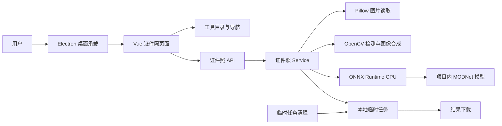
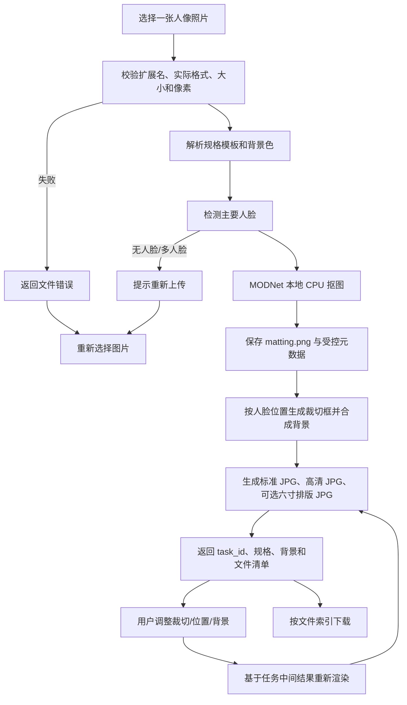

# 证件照模块开发设计

> 本文档针对“工具盒子”中的证件照模块，描述该模块的需求、项目内结构与流程、数据库和 API 设计。证件照业务代码已按本文档接入，模型质量、模板口径和许可证仍需继续核验。

---

## 1. 需求

### 1.1 已确认的项目事实

| 事项 | 当前项目事实 |
| --- | --- |
| 应用形态 | Electron 承载 Vue 3 + TypeScript 前端，并启动本地 FastAPI 服务。 |
| 后端入口 | `backend/app/main.py` 注册 FastAPI 生命周期、工具路由和依赖可用性检查。 |
| 后端模块组织 | 工具按 `api/v1/tools`、`schemas/tools`、`services/tools` 组织；图片格式转换是最接近的同类实现。 |
| API 契约 | 接口统一使用 POST；普通响应使用 `{code, message, data}`，由 `success()` / `error()` 构造。 |
| 文件任务 | 常规文件工具使用 `backend/temp/tasks/{task_id}` 保存临时输入、结果和下载产物；任务 ID 由 `validate_task_id()` 校验。 |
| 临时数据清理 | `cleanup_expired_temp()` 在服务启动时清理超过保留期限的临时任务，当前默认期限为 24 小时。 |
| 模型资源 | 项目已有 `backend/resources/mineru` 形式的项目内模型目录，`resources` 已被 Git 忽略；证件照模型规划存放于 `backend/resources/id_photo`。 |
| 数据库 | 项目配置存在 SQLite `DATABASE_URL`，但现有文件处理工具不以数据库保存任务记录；本模块不新增数据库表。 |
| 前端工具注册 | `frontend/src/router/tools.ts` 从后端工具列表合并本地组件注册表并动态生成工具路由。 |
| 当前实现状态 | 证件照后端路由、Schema、Service、工具注册和 Vue 页面已接入；仍需补充正式质量验证和模板/模型许可核验。 |

### 1.2 模块目标

证件照模块为用户提供本地优先的单人证件照处理能力：用户上传一张人像照片，选择适用的照片规格和背景色，系统在本机完成抠图、裁切、换底、尺寸输出，并可生成六寸排版照供下载。

模块不把“证件照”理解为单一全国统一规格。规格采用模板驱动，模板名称、像素尺寸和用途说明必须在界面中同时展示；输出结果不得宣称一定符合某个机构的最新审核要求。

### 1.3 功能需求

1. **单人照片接入**
   - 支持 JPG、JPEG、PNG、WebP 等常见静态图片。
   - 单次处理一张图片；服务端根据实际内容校验格式，而不是只信任文件扩展名。
   - 对空文件、损坏图片、超过大小或像素限制的文件给出可恢复的错误信息。

2. **规格模板**
   - 首期提供常用一寸、二寸/小二寸模板，并保留自定义宽高入口。
   - 模板至少保存显示名称、目标宽度、目标高度和用途说明。
   - 自定义尺寸限制在合理的像素范围和纵向证件照比例范围内，避免生成异常大图或横向结果。

3. **人像识别与抠图**
   - 默认要求输入图中恰好一张主要人脸；未检测到人脸或检测到多张人脸时拒绝处理并提示重新上传。
   - 使用项目内模型资源进行本地人像抠图，首期采用 MODNet ONNX CPU 推理；运行时不上传用户照片。
   - 人脸检测器和抠图器均通过服务层内部边界隔离，便于后续替换更高质量的检测模型。

4. **裁切与人工微调**
   - 自动根据人脸位置和目标比例生成初始裁切框，保留头顶、肩部和证件照所需的上下空间。
   - 结果阶段允许调整裁切范围、水平偏移和垂直偏移，并重新渲染，不重复上传和抠图。
   - 调整参数必须限制在服务端允许范围内，避免越界读取任务文件或生成不可处理尺寸。

5. **背景与结果**
   - 提供白、蓝、红预设背景色，并支持输入合法的六位十六进制自定义颜色。
   - 输出标准电子证件照 JPG；同时提供较大尺寸的高清 JPG。
   - 支持 JPEG 质量、DPI 和单文件 KB 上限控制；KB 上限作为压缩目标，无法满足时返回可理解的失败原因。
   - 可选生成六寸排版照。排版照按当前规格生成可打印布局，不承诺替代目标机构的官方排版要求。
   - 结果页面展示尺寸、背景色、文件大小和下载入口，并支持重新处理或重新上传。

6. **任务和隐私**
   - 每次处理建立独立临时任务目录，仅保存完成重新渲染所需的抠图中间结果、元数据和输出文件。
   - 下载完成后不自动进入长期资料库；任务按现有临时文件清理规则过期删除。
   - 日志只记录任务 ID、规格、模型和耗时等必要信息，不记录原图内容、完整路径或人脸图像。

### 1.4 非功能需求

- **本地优先**：用户照片、抠图中间结果和输出文件只在本机 FastAPI 服务及其临时目录中流转；模型运行不依赖云端推理。
- **可用性**：模型文件缺失或 ONNX Runtime 不可用时，工具目录应显示不可用原因，不能让用户进入后才失败。
- **安全性**：上传文件名只用于展示和结果命名，不能直接作为路径；任务 ID、下载索引和任务目录必须进行边界校验。
- **可靠性**：处理失败时清理半成品任务；输出写入完成后才加入响应；重新渲染应可重复执行且不产生孤儿文件。
- **并发性**：模型会话在进程内按需加载并复用；同一任务的重新渲染应通过任务级互斥或等价策略避免互相覆盖。
- **性能**：首期以本地 CPU 推理为基线，不承诺实时处理；应在实现阶段记录抠图耗时和输出耗时，若同步接口明显阻塞，再评估进程池或持久任务队列。
- **可维护性**：规格、背景色、裁切参数和模型路径集中定义，API 层不承载图像算法和文件业务规则。

### 1.5 当前范围、范围外事项与职责边界

**当前范围**：单人照片、自动人脸检测、MODNet 本地抠图、白/蓝/红/自定义背景、常用规格、自定义像素尺寸、自动裁切、结果微调、电子照片、高清照片、JPEG 质量/DPI/KB 控制、可选六寸排版照、本地临时任务和下载。

**明确不做**：

- AI 美颜、换脸、生成式补脸或改变人物身份特征；
- 批量处理和多人合照拆分；
- 云端处理、账号同步和长期照片库；
- 国际签证模板和所有机构的自动合规校验；
- 自动识别并保证服装、领带、发型、饰品等机构级要求；
- 直接集成 AGPL 代码或未经独立核验许可的模型权重；
- 以本模块替代目标机构发布的最新证件照规范。

**职责边界**：

- 前端负责上传、参数选择、预览、调整和下载交互，不实现抠图算法。
- FastAPI Router 负责 multipart/JSON 参数接收、统一响应和异常映射。
- 证件照 Service 负责图片校验、模型调用、裁切、合成、排版和任务文件生命周期。
- 工具目录负责反映模型和运行能力是否可用，不负责处理照片。
- 通用临时任务工具负责任务路径计算、任务 ID 校验和过期清理，不负责证件照文件命名规则。

### 1.6 可观察的验收标准

1. 证件照工具能在后端模型可用时出现在首页和侧边栏，模型缺失时显示明确原因并禁止进入。
2. 上传一张合规人像后，能得到选择规格对应的标准 JPG、高清 JPG，并按选择生成排版 JPG。
3. 白、蓝、红背景均能通过同一任务重新渲染；重新渲染不需要再次上传原图或重新执行抠图。
4. 裁切范围和水平/垂直偏移调整能影响最终预览和下载文件。
5. 无人脸、多人脸、损坏图片、超限图片和模型不可用时，均返回项目统一错误结构，页面处于可重试状态。
6. 下载只能访问当前合法任务的结果索引；非法任务 ID、过期任务或不存在的索引不能读取其他文件。
7. 服务重启后，超过清理期限的证件照任务被清理；项目内模型资源不被临时任务清理逻辑误删。
8. 输出和日志不包含用户原图内容；模块不新增数据库记录，不产生云端文件。

---

## 2. 该项目的模块结构与流程

### 2.1 在当前项目中的位置

当前项目采用“工具 Router + Schema + Service”后端结构，以及“远端工具目录 + 本地页面注册”的前端结构。证件照模块实施时沿用该结构，不另起独立 FastAPI 服务或独立前端工程。

| 设计位置 | 规划职责 | 当前状态 |
| --- | --- | --- |
| `backend/app/api/v1/tools/id_photo.py` | 接收处理、重新渲染和下载请求，调用 Service 并封装统一响应 | 已新增 |
| `backend/app/schemas/tools/id_photo.py` | 定义处理结果、重新渲染请求、下载请求和文件条目 Schema | 已新增 |
| `backend/app/services/tools/id_photo.py` | 图片读取与限制校验、模型会话、人脸检测、抠图、裁切、背景合成、排版和临时任务管理 | 已新增 |
| `backend/app/core/config.py` | 提供项目内证件照模型目录配置 | 已扩展 |
| `backend/app/services/tools/list.py` | 注册工具描述并根据模型能力填充 `available` | 已扩展 |
| `backend/app/main.py` | 注册 Router、启动时检查证件照模型和运行能力 | 已扩展 |
| `frontend/src/api/tools.ts` | 提供证件照处理、重新渲染、预览读取和下载 API 调用 | 已扩展 |
| `frontend/src/views/tools/IdPhoto.vue` | 上传、规格/背景设置、处理状态、结果预览、微调和下载 | 已新增 |
| `frontend/src/router/tools.ts` | 将 `id-photo` 与页面组件合并到动态工具注册表 | 已扩展 |
| `backend/resources/id_photo/` | 保存本地 MODNet 等模型文件，不进入任务清理目录 | 已建立资源目录；资源清单和许可需在实施前复核 |
| `backend/temp/tasks/{task_id}/` | 保存单次任务的抠图中间结果、元数据和输出文件 | 复用现有临时任务机制 |

### 2.2 项目级模块关系



工具目录通过现有 `POST /api/v1/tools/list` 获取证件照条目。证件照页面通过 `frontend/src/api/tools.ts` 调用 FastAPI；Service 不返回 `ApiResponse`，而是返回业务结果或抛出 `ServiceException`。

### 2.3 模块内部边界

1. **入口层**：Router 只处理 HTTP 参数、`UploadFile`、Request Schema、`success()` / `error()` 和 `FileResponse`。不在 Router 中执行模型推理或直接拼接任务路径。
2. **业务层**：Service 负责证件照完整处理流程，接收已解析的请求参数，输出响应 Schema 所需的业务对象。图像算法、任务目录和模型会话均封装在该边界内。
3. **模型边界**：模型加载采用按需初始化的单例会话，固定使用 CPU Provider；模型路径来自 `settings.id_photo_model_path`，禁止回退到用户目录或云端自动下载。
4. **前端边界**：页面只保存当前任务 ID、表单参数、结果清单和预览 URL。响应字段保持后端 snake_case；如需转换为 camelCase，只在 API 模块完成，不在模板中散落映射。
5. **共享边界**：复用 `safe_filename()`、`get_task_dir()`、`validate_task_id()`、`cleanup_expired_temp()` 和现有错误码，不改写第二套任务或响应机制。

### 2.4 核心处理流程



具体步骤：

1. 前端提交单个 `file` 和规格、背景、排版参数。
2. Service 使用 `safe_filename()` 生成展示名，读取上传内容，检查实际图片格式、文件大小和像素数量，并处理 EXIF 方向。
3. 解析模板得到目标宽高；解析背景色得到受控的 BGR/RGB 值，不接受任意文件路径或 CSS 内容。
4. 使用人脸检测器确认一张主要人脸，记录人脸框，不保存原始人脸裁剪图。
5. 使用本地 MODNet ONNX 会话生成 Alpha 遮罩，与原图组成带透明通道的中间图。
6. 在任务目录写入 `matting.png` 和仅包含任务、规格、人脸框、原始尺寸等必要信息的 `metadata.json`。
7. 根据目标比例、脸部测量比例和微调参数生成裁切框；越界部分使用透明填充，随后合成背景并输出 JPG。
8. 结果接口只返回文件元数据。前端通过下载接口获取标准 JPG 作为预览，用户可下载高清和排版结果。
9. 重新渲染只读取当前任务的 `matting.png` 和元数据，覆盖本任务输出，不重复运行抠图模型。
10. 启动时及任务过期时由统一清理逻辑删除临时任务；模型目录不在 `temp` 下，不被任务清理删除。

### 2.5 数据流、状态流与并发规则

| 状态 | 产生位置 | 页面表现 | 允许动作 |
| --- | --- | --- | --- |
| `idle` | 前端初始状态 | 上传区和规格设置 | 选择文件、修改参数 |
| `processing` | `process` 请求发出后 | 显示本地处理中，禁止重复提交 | 可取消页面操作或等待结果 |
| `ready` | 初次处理完成 | 显示标准预览、文件清单和微调控件 | 调整参数、重新渲染、下载、重新上传 |
| `rendering` | `render` 请求发出后 | 保留旧预览并显示局部更新状态 | 禁止重复渲染提交，下载按钮按策略禁用 |
| `failed` | 业务错误、模型错误或网络错误 | 显示具体原因和重试入口 | 重新上传或修正参数 |
| `expired` | 任务目录已被清理 | 下载/重新渲染返回任务过期 | 重新上传并创建任务 |

- 首期接口使用同步 Router 函数，以匹配现有文件转换工具；CPU 密集型推理实际运行在线程池边界内，不使用普通 `BackgroundTasks` 假装异步。
- 模型会话按进程复用，并使用初始化锁避免并发请求重复加载大模型。
- `process` 每次创建新任务，不做内容去重；`render` 对同一任务和参数具有幂等语义，输出文件使用临时文件写入后原子替换。
- 同一任务的并发 `render` 请求必须串行化或使用任务级锁；不同任务可以并行，但并发度应受 FastAPI 工作线程和机器内存约束。
- 下载只读取已完成的输出文件。任务被清理后，下载和重新渲染统一返回 `DATA_NOT_FOUND`，不暴露本地路径。
- 实现阶段应记录任务总耗时、抠图耗时和渲染耗时；不记录原图、Alpha 图或文本内容。

### 2.6 关键技术选择

| 选择 | 设计决定 | 与当前项目的关系 |
| --- | --- | --- |
| 处理管线 | 参考 HivisionIDPhotos 的“人脸定位—抠图—裁切—换底—排版”流程，但封装进现有 FastAPI 工具服务 | 避免再启动一套 API，复用当前工具目录、统一响应和临时任务机制 |
| 抠图模型 | 首期使用本地 MODNet ONNX，CPU 推理；当前已下载的模型放在 `backend/resources/id_photo/hivision_modnet.onnx` | 项目已有 OpenCV/Pillow 图像依赖；模型文件与用户任务目录分离 |
| 人脸检测 | 已采用 `mtcnn-runtime` 的本地 MTCNN CPU 推理，并将 `pnet.onnx`、`rnet.onnx`、`onet.onnx` 复制到项目资源目录；Service 仍保留检测器替换边界 | 依赖已加入 Python 3.12 环境；模型权重许可证和更多样本质量仍需复核 |
| 图片处理 | Pillow 负责可靠读取、EXIF 方向和 JPG 元数据；OpenCV 负责检测、Alpha 合成和排版 | 延续现有图片转换服务的 Pillow 习惯，并利用已存在的 OpenCV |
| 模板配置 | 代码内受控模板表 + 自定义尺寸校验，不把机构标准硬编码为唯一标准 | 适应不同报名、考试和证件场景的规格差异 |
| 运行方式 | 集成现有 FastAPI，不直接集成 Hivision 独立 API | 保持桌面端本地进程、统一错误和工具可用性判断 |

模型权重的来源、许可证和再分发条件必须在实施前形成可追溯记录；`rembg` 或其他库的代码许可证不能自动推导其模型权重许可证。若候选检测模型无法满足 Python 3.12、CPU 或许可证要求，应保留检测器接口并更换实现，不改变 API 和任务数据边界。

---

## 3. 数据库的设计

### 3.1 数据库使用结论

本模块**不直接持久化到数据库**，不新增 SQLite 表、SQLAlchemy Model、Repository、索引或数据库迁移。当前项目的 `DATABASE_URL` 是通用配置事实，但证件照任务不写入该数据库。

原因：证件照输出属于短期本地处理产物，不需要跨重启查询、账号关联、历史检索或业务统计；将原图、Alpha 中间结果或任务记录写入数据库会扩大隐私和清理边界。

### 3.2 临时任务文件结构

任务数据由现有本地任务存储负责，设计结构如下：

```text
backend/temp/tasks/{task_id}/
├── matting.png          # 带 Alpha 通道的人像中间结果，仅供重新渲染
├── metadata.json        # 受控的任务元数据，不包含原图和模型输出文本
├── 0_standard.jpg      # 标准电子证件照
├── 1_hd.jpg             # 高清电子证件照
└── 2_layout.jpg         # 可选六寸排版照
```

`metadata.json` 只保存重新渲染所需字段，设计字段如下：

| 字段 | 类型 | 可空 | 用途 |
| --- | --- | --- | --- |
| `task_id` | string | 否 | 与目录名一致，用于一致性校验 |
| `template_id` | string | 否 | 规格模板标识 |
| `template_name` | string | 否 | 结果展示名称 |
| `width` / `height` | integer | 否 | 目标像素尺寸 |
| `face` | object | 否 | 在受限处理图中的人脸框坐标 |
| `source_width` / `source_height` | integer | 否 | 处理图原始尺寸 |
| `model` | string | 否 | 使用的本地模型名称，不保存完整本地路径 |
| `original_stem` | string | 否 | 已净化的结果文件名片段 |

背景色、裁切微调参数和是否生成排版照属于每次渲染请求；如需审计当前结果，只以当前输出文件和响应为准，不建立历史版本记录。

### 3.3 生命周期、事务与一致性

- **创建**：文件和图片校验通过、人脸检测成功后才创建任务目录；抠图或输出失败时删除整个任务目录。
- **写入**：中间图、元数据和 JPG 使用临时文件写入，完成后再替换目标文件；响应只引用已存在且尺寸/文件大小校验通过的文件。
- **读取**：重新渲染必须通过合法 `task_id` 定位任务目录，并确认目录位于 `TEMP_DIR` 下；不能接受客户端传入任意路径。
- **更新**：重新渲染只覆盖当前任务的输出文件，不修改数据库、不追加历史文件；同一任务通过锁避免并发写入覆盖。
- **删除**：复用 `cleanup_expired_temp(max_hours=24)` 删除过期任务；不删除 `backend/resources/id_photo` 下的模型。用户主动重新上传时，旧任务不立即删除，由统一清理策略负责。
- **备份与导出**：模块不自动备份、不向云端导出；用户通过下载接口主动保存结果。模型文件属于本地运行资源，和用户照片生命周期分离。
- **事务边界**：不存在数据库事务；一个 HTTP 处理请求内部以“任务目录创建—中间结果写入—输出完成—返回响应”为一致性边界。失败清理承担回滚职责。

### 3.4 结构变化策略

本模块不涉及数据库结构变化，不创建迁移链。未来如果需要历史记录、账号关联或结果检索，应先单独设计持久化模型、隐私保留策略和删除授权，不把临时 `metadata.json` 直接升级为业务数据库表。

---

## 4. API 接口的设计

### 4.1 通用契约

- 证件照新增接口全部使用 **POST**，通过动作路径区分处理、重新渲染和下载。
- JSON Body 必须使用 Pydantic Request Schema；multipart 接口使用 `UploadFile` + `Form`，并在 Service 层再次校验文件内容。
- 业务响应使用 `ApiResponse[T]`，成功通过 `success()`，业务失败通过 `error()`；Service 不返回 `ApiResponse`。
- 处理和重新渲染返回 JSON；下载成功返回 `FileResponse` 二进制，下载失败仍返回项目统一错误结构。
- 当前项目没有认证体系。证件照 API 仅面向本机桌面应用使用；任务 ID 只能视为本地临时能力标识，若未来监听非本机地址，必须增加认证和任务归属校验。
- 不提供 GET、PUT、PATCH、DELETE 接口，不使用分页、排序或长期历史查询。

### 4.2 处理接口

**接口**：`POST /api/v1/tools/id-photo/process`

**调用方向**：`frontend/src/views/tools/IdPhoto.vue` → `frontend/src/api/tools.ts` → FastAPI Router → 证件照 Service。

**请求类型**：`multipart/form-data`。

| 字段 | 类型 | 必填 | 约束与说明 |
| --- | --- | --- | --- |
| `file` | UploadFile | 是 | 单张 JPG/JPEG/PNG/WebP 静态图片；服务端校验实际内容 |
| `template_id` | string | 是 | `one-inch`、`small-two-inch`、`two-inch` 或 `custom` |
| `width` | integer | `custom` 时是 | 自定义目标宽度，服务端限制范围 |
| `height` | integer | `custom` 时是 | 自定义目标高度，服务端限制范围 |
| `background_color` | string | 否 | `white`、`blue`、`red` 或 `#RRGGBB`，默认白色 |
| `include_layout` | boolean | 否 | 是否生成六寸排版照，默认 `true` |
| `quality` | integer | 否 | JPEG 初始质量，60～100，默认 `95` |
| `dpi` | integer | 否 | 输出 DPI，72～600，默认 `300` |
| `max_file_size_kb` | integer | 否 | 单个结果的压缩目标，10～2048；不传表示不限制 |

**成功响应**：`ApiResponse[IdPhotoResponse]`。

```json
{
  "code": 0,
  "message": "success",
  "data": {
    "task_id": "a1b2c3d4e5f6",
    "template_id": "one-inch",
    "template_name": "一寸（25×35毫米）",
    "width": 295,
    "height": 413,
    "background_color": "white",
    "model": "hivision_modnet.onnx",
    "quality": 95,
    "dpi": 300,
    "max_file_size_kb": null,
    "files": [
      {"kind": "standard", "filename": "photo_one-inch_white.jpg", "file_size": 123456, "index": 0},
      {"kind": "hd", "filename": "photo_one-inch_white_hd.jpg", "file_size": 234567, "index": 1},
      {"kind": "layout", "filename": "photo_one-inch_white_layout.jpg", "file_size": 345678, "index": 2}
    ]
  }
}
```

### 4.3 重新渲染接口

**接口**：`POST /api/v1/tools/id-photo/render`

**请求体**：`IdPhotoRenderRequest`。

```json
{
  "task_id": "a1b2c3d4e5f6",
  "background_color": "#438EDB",
  "crop_scale": 1.0,
  "offset_x": 0.0,
  "offset_y": -0.02,
  "include_layout": true,
  "quality": 90,
  "dpi": 300,
  "max_file_size_kb": 100
}
```

| 字段 | 类型 | 约束 | 说明 |
| --- | --- | --- | --- |
| `task_id` | string | 12 位小写十六进制 | 只能访问当前任务目录 |
| `background_color` | string | 预设或 `#RRGGBB` | 替换背景色 |
| `crop_scale` | number | 建议 `0.85`～`1.25` | 调整裁切范围；服务端再次限制 |
| `offset_x` | number | 建议 `-0.15`～`0.15` | 水平裁切偏移比例 |
| `offset_y` | number | 建议 `-0.15`～`0.15` | 垂直裁切偏移比例 |
| `include_layout` | boolean | — | 是否保留/重新生成排版照 |
| `quality` | integer | 60～100 | JPEG 初始质量，服务端可继续降低质量以满足 KB 目标 |
| `dpi` | integer | 72～600 | 输出文件 DPI 元数据 |
| `max_file_size_kb` | integer/null | 10～2048 或空 | 单个结果的压缩目标，空值不限制 |

**成功响应**：与处理接口相同的 `ApiResponse[IdPhotoResponse]`；任务 ID 和规格保持不变，文件元数据反映本次渲染结果。

该接口是幂等的：相同任务和参数重复调用不会创建新任务；不同参数调用会替换当前任务的结果文件。接口不允许客户端修改模板尺寸、原始人脸框或模型路径。

### 4.4 结果下载接口

**接口**：`POST /api/v1/tools/id-photo/download`

**请求体**：`IdPhotoDownloadRequest`。

```json
{
  "task_id": "a1b2c3d4e5f6",
  "file_index": 0
}
```

**成功响应**：`FileResponse`，媒体类型为 `image/jpeg`，通过 `Content-Disposition` 返回服务端生成的安全文件名。

**失败响应**：项目统一 `{code, message, data}`。服务端只允许访问结果文件前缀对应的索引，不允许传入文件名、相对路径或绝对路径。

### 4.5 工具可用性与注册关系

证件照不是新增独立的可用性查询 API。实现时扩展现有 `POST /api/v1/tools/list`：

- `backend/app/main.py` 启动生命周期检查本地模型文件和 ONNX Runtime 能力；
- `backend/app/services/tools/list.py` 为证件照条目填充 `available` 和不可用原因；
- `frontend/src/router/tools.ts` 合并 `id-photo` 本地组件；
- 首页和侧边栏沿用现有不可用工具禁止进入的规则。

实现中已为工具列表 Schema 增加可选的 `unavailable_reason` 字段，并保持其他工具响应兼容。

### 4.6 错误边界和错误码

| 场景 | 现有业务错误码 | 对用户的处理 |
| --- | ---: | --- |
| 规格、背景色或微调参数不合法 | `PARAM_ERROR`（1001） | 保留当前表单内容，提示修正 |
| 任务不存在或已过期 | `DATA_NOT_FOUND`（1002） | 清除失效结果，提示重新上传 |
| 扩展名或实际内容不支持 | `UNSUPPORTED_FILE_FORMAT`（3001） | 返回上传区重新选择 |
| 文件超过大小或像素限制 | `FILE_TOO_LARGE`（3002）或参数错误 | 显示具体限制 |
| 图像处理、模型推理或输出校验失败 | `CONVERSION_FAILED`（3003）或 `AI_SERVICE_ERROR`（4001） | 显示可理解的失败原因，不返回堆栈 |
| 未检测到人脸或检测到多张人脸 | `UNSUPPORTED_CONTENT`（3005） | 提示使用单人、正面、光线清晰照片 |
| 模型文件、ONNX Runtime 或必要运行能力缺失 | `SERVICE_UNAVAILABLE`（5002） | 工具目录显示不可用原因 |
| 未预期内部错误 | `INTERNAL_ERROR`（5001） | 记录带 task_id 的内部日志，前端显示通用重试提示 |

Router 遵循现有工具实现的统一 `try/except ServiceException` 兼容方式；若后续统一异常处理器覆盖该边界，不再在多个 Router 重复映射。

### 4.7 前端调用和交互约束

- `frontend/src/api/tools.ts` 定义后端 snake_case DTO 和三个端点调用，负责 Envelope 解包、二进制下载和 `Content-Disposition` 文件名解析；页面不直接拼接 API URL。
- 页面必须区分初次处理、局部重新渲染、成功、失败和任务过期状态；重复提交和重复渲染需要禁用对应按钮。
- 预览 URL 由前端从下载响应生成，并在替换、重新上传和组件卸载时释放 `URL.createObjectURL()`，不把任务文件 URL 永久写入页面状态。
- 重新渲染只接受最新请求结果，旧响应不能覆盖较新的滑块调整；实现时至少使用请求序号或 `AbortController`。
- 前端不缓存原始文件到 Pinia 或本地持久化存储；当前页重置后只保留用户已主动下载到系统的位置。
- 颜色选择必须同时显示色名/色值，不能只使用颜色区分；表单控件需要关联可见 `label`，处理中和错误状态使用可访问的状态播报。

### 4.8 实施顺序、风险与确认点

1. 先补充模板、错误、响应和下载 Schema，以及资源目录配置。
2. 实现模型可用性检查、图片读取限制和任务文件结构。
3. 接入抠图和人脸检测器，完成自动裁切、背景合成和排版输出。
4. 接入处理、重新渲染和下载 Router，并注册工具可用状态。
5. 实现前端页面、动态路由、结果预览、微调和下载。
6. 使用代表性单人照片进行人工验收，重点检查发丝边缘、肩部、不同背景和多脸错误。

实施前仍需确认：

- 选定的人脸检测模型是否兼容 Python 3.12、CPU 推理和项目资源目录约束；
- 检测模型及 MODNet 权重的来源、许可证和再分发条件；
- 一寸、二寸、小二寸模板的目标机构和最终像素口径；
- 六寸排版照的纸张像素、DPI、间距和是否需要裁切线；
- 单次 CPU 推理耗时是否满足同步接口体验，是否需要进程池。

这些事项不应在实现中被默认为“官方合规”或“已验证兼容”；确认前只能按设计假设实现并在界面中保留适用范围提示。
