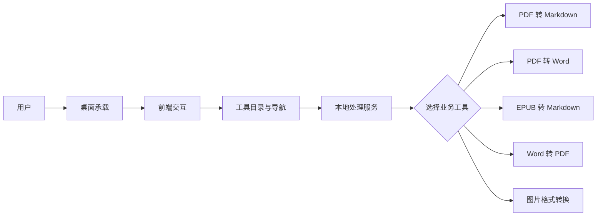
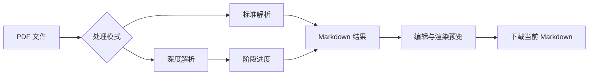
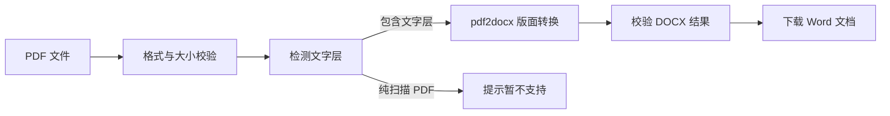
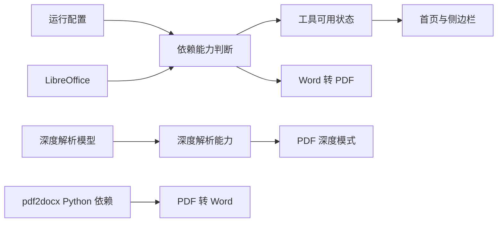
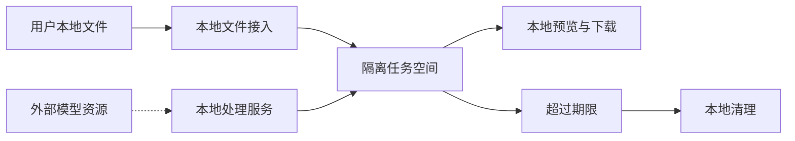

# 工具盒子 — 模块说明文档

> 本文档从业务需求和功能设计角度说明工具盒子的模块边界、端侧职责、依赖关系与典型流程。
> `doc/项目结构文档.md` 负责说明代码组织，本文档负责说明各模块如何共同支撑用户目标。
> 更新日期：2026-07-31
>
> **项目基础信息**
>
> | 范畴 | 技术栈或依赖 | 版本信息 | 主要职责 |
> | --- | --- | --- | --- |
> | 桌面应用 | Electron | 43.2.0 | 提供桌面窗口、应用生命周期和本地进程协同 |
> | 运行环境 | Node.js | >= 18.0.0（前端工程约束） | 支持前端开发和桌面应用运行链路 |
> | 前端框架 | Vue、Vue Router、Pinia | Vue 3.5.13、Vue Router 4.5.0、Pinia 3.0.2 | 提供工具入口、交互流程、状态展示和结果操作 |
> | 前端工程化 | Vite、TypeScript、Tailwind CSS | Vite 6.3.0、TypeScript 5.7、Tailwind CSS 4.1.4 | 负责前端构建、类型约束和界面样式 |
> | 图标与内容展示 | Font Awesome、Marked、Highlight.js | Font Awesome 6.7.2、Marked 18.0.5、Highlight.js 11.11.1 | 提供界面图标、Markdown 渲染和代码高亮 |
> | 后端框架 | Python、FastAPI、Uvicorn | Python >= 3.12、FastAPI >= 0.138.0、Uvicorn >= 0.49.0 | 提供本地文件处理、工具能力编排和统一错误反馈 |
> | PDF 处理 | PyMuPDF、MinerU、pdf2docx | PyMuPDF >= 1.27.2.3、MinerU >= 3.2.0、pdf2docx == 0.5.13 | 分别支持常规解析、复杂版面深度解析和文字型 PDF 转 Word |
> | EPUB 处理 | markdownify | >= 0.14.1 | 将电子书章节内容整理为 Markdown |
> | 图片处理 | Pillow | >= 12.2.0 | 支持图片格式转换、质量处理和多文件结果生成 |
> | Word 处理 | LibreOffice | 外部运行时依赖，版本未固定 | 将 Word 文档转换为 PDF |
> | 数据保存 | 本地临时任务文件 | 当前以本地文件为主 | 保存转换过程中的输入副本、结果和下载产物，并按生命周期清理 |

---

## 1. 文档定位

本文档面向产品设计、开发、测试和架构评审人员，用于理解系统提供的业务能力、每个模块负责的用户目标，以及模块之间如何协作完成一次转换任务。它不替代代码组织文档，也不展开具体文件、类、接口参数或实现步骤。

建议先阅读第 2 至第 4 节建立整体认识，再阅读第 5 节了解单个模块，最后结合第 7、8 节理解跨模块流程和完整业务闭环。

## 2. 系统功能定位

工具盒子是一个**本地优先的桌面工具集合**：用户在统一入口中选择文件处理工具，完成文档转换、电子书整理或图片格式转换，并在本地预览、编辑或下载结果。

系统当前围绕以下能力方向设计：

| 能力方向 | 用户需求 | 系统提供的能力 |
| --- | --- | --- |
| 统一工具入口 | 用户需要快速找到并切换工具 | 首页工具总览、侧边栏导航、工具可用状态展示 |
| 文档格式处理 | 用户需要把常见文档转换为更易编辑或流转的格式 | PDF 转 Markdown、PDF 转 Word、EPUB 转 Markdown、Word 转 PDF |
| 复杂文档解析 | 用户面对扫描件、复杂版面或多栏文档时需要更高质量的结构提取 | PDF 标准解析与深度解析两种模式 |
| 图片格式处理 | 用户需要在不同图片格式之间转换，或一次处理多张图片 | 单张转换、批量转换、质量设置和 ZIP 打包下载 |
| 本地隐私与可控交付 | 用户希望文件不经过业务云端，并能明确掌握结果 | 本地处理、任务隔离、结果预览、结果下载和过期清理 |

## 3. 端侧职责划分

| 端侧或能力层 | 职责定位 | 主要关注点 | 不承担的职责 |
| --- | --- | --- | --- |
| 桌面承载层 | 负责应用启动、窗口管理和本地运行环境协同 | 后端就绪确认、窗口控制、退出时清理本地进程 | 不判断具体文件格式，也不执行转换规则 |
| 前端交互层 | 负责工具发现、文件选择、参数设置、进度展示、预览和下载 | 用户流程完整、状态清晰、不可用工具正确提示 | 不直接实现文档或图片转换 |
| 本地处理服务层 | 负责校验文件、调用处理引擎、管理任务结果和返回业务错误 | 工具边界、任务隔离、依赖检测、结果可追溯 | 不负责页面布局和桌面窗口表现 |
| 本地任务存储层 | 负责保存转换过程中的临时输入、输出和下载产物 | 任务目录隔离、路径安全、文件生命周期、过期清理 | 不承担长期用户资料、账号或云端同步 |
| 本地处理引擎层 | 负责具体格式解析和转换 | 引擎能力差异、超时、资源占用、输出质量 | 不决定工具入口和用户交互流程 |
| 外部运行时依赖 | 为特定能力提供运行环境或模型资源 | LibreOffice 的可用性、深度解析模型的获取与缓存 | 不接收业务层面的用户操作和任务编排 |

当前产品没有独立的账号体系和云端业务服务。用户文件由本地处理服务完成处理；深度解析所需的模型资源可能根据运行配置从外部模型源获取，这不改变用户文件以本地处理为主的数据边界。

## 4. 功能模块总览

| 模块 | 业务定位 | 核心产出 | 直接依赖 |
| --- | --- | --- | --- |
| 应用承载与窗口 | 提供稳定的桌面运行外壳 | 应用窗口、启动协同、优雅退出 | 前端交互层、本地处理服务 |
| 工具目录与导航 | 统一管理工具入口和可用状态 | 首页工具总览、侧边栏、工具切换 | 应用承载与窗口、各业务工具、本地能力状态 |
| PDF 转 Markdown | 将 PDF 内容整理为可编辑的 Markdown | Markdown 文本、结构统计、图片资源引用 | 文件校验、PDF 处理引擎、任务结果交付 |
| PDF 转 Word | 将包含文字层的 PDF 转换为可编辑 Word | DOCX 文件、页数信息、转换警告 | 文件校验、PyMuPDF、pdf2docx、任务结果交付 |
| EPUB 转 Markdown | 将 EPUB 电子书章节整理为 Markdown | 章节化 Markdown、图片资源、ZIP 下载包 | 文件安全校验、EPUB 处理引擎、任务结果交付 |
| Word 转 PDF | 将 Word 文档转换为可分发的 PDF | PDF 文件、原始文件名对应关系 | LibreOffice、本地任务存储、工具可用性判断 |
| 图片格式转换 | 将图片转换为指定格式并交付结果 | 单张图片、批量图片清单或 ZIP 包 | 图片处理引擎、文件限制校验、任务结果交付 |
| 任务结果交付 | 统一承接各工具的预览、下载和生命周期 | 任务结果、预览内容、下载文件、过期清理 | 所有转换工具、本地任务存储 |
| 通用运行支撑 | 为跨模块流程提供一致的边界和反馈 | 文件校验、进度状态、错误提示、隐私边界 | 桌面承载层、前端交互层、本地处理服务 |

## 5. 各业务模块说明

### 5.1 应用承载与窗口

- **定位**：为工具盒子提供桌面应用的运行外壳，使前端界面和本地处理服务能够被统一启动、使用和关闭。
- **核心功能**：
  - 启动并协调前端界面与本地处理服务。
  - 在处理服务真正就绪后再进入可操作状态。
  - 提供窗口最小化、最大化、还原和关闭能力。
  - 区分开发运行和打包运行时的页面加载方式。
  - 应用退出时回收由应用启动的本地进程。
- **设计边界**：不包含任何 PDF、EPUB、Word 或图片的业务规则；不决定工具是否可用；不保存用户转换结果。
- **关联模块**：工具目录与导航、本地处理服务、任务结果交付。
- **开发关注点**：
  - 启动失败必须能够区分前端未就绪、处理服务未就绪和外部依赖不可用。
  - 关闭应用时不能遗留由应用启动的本地处理进程。
  - 窗口控制只影响桌面承载，不应改变工具页面的业务状态。
  - 新增工具不应要求桌面承载层增加工具专属分支。

### 5.2 工具目录与导航

- **定位**：为用户提供所有工具的统一发现、进入和切换入口，并反映工具当前是否具备使用条件。
- **核心功能**：
  - 在首页展示工具名称、用途和可用状态。
  - 在侧边栏提供工具之间的快速切换。
  - 进入工具页面时展示当前工具，并保持导航状态一致。
  - 对缺少必要运行依赖的工具进行灰化和不可进入处理。
  - 在工具不存在或路径无效时提供兜底页面。
- **设计边界**：只负责入口、展示和导航，不处理文件、不执行转换，也不替代各工具页面的参数校验。
- **关联模块**：应用承载与窗口、PDF 转 Markdown、PDF 转 Word、EPUB 转 Markdown、Word 转 PDF、图片格式转换、通用运行支撑。
- **开发关注点**：
  - 首页和侧边栏必须展示同一套工具信息，避免入口状态不一致。
  - 工具的可用状态应来自实际运行能力，不能只依据界面配置判断。
  - 不可用工具需要在进入前给出原因，不应让用户进入后才发现无法使用。
  - 新增工具应同时具备名称、用途、入口和可用状态，不能只增加一个页面。

### 5.3 PDF 转 Markdown

- **定位**：将 PDF 中的文本、表格和图片信息整理为可继续编辑和流转的 Markdown 内容。
- **核心功能**：
  - 接收 PDF 文件并进行格式、大小和可解析性校验。
  - 提供标准解析和深度解析两种处理模式。
  - 标准模式面向常规 PDF，强调处理速度和即时反馈。
  - 深度模式面向扫描件、复杂版面和多栏内容，提供阶段性进度。
  - 展示 Markdown 原文、渲染预览和页数、表格数、图片数等统计信息。
  - 允许用户在结果阶段调整 Markdown 内容，并下载当前内容。
  - 支持失败后重新上传，避免用户被留在不可恢复的状态。
- **设计边界**：不负责 EPUB、Word 或图片转换；不保证所有 PDF 的视觉排版被完全还原；深度模式不等同于远程人工校对服务。
- **关联模块**：工具目录与导航、任务结果交付、通用运行支撑、PDF 处理引擎。
- **开发关注点**：
  - 处理模式应由用户明确选择，不能在没有说明的情况下隐式切换。
  - 深度模式的进度必须反映实际阶段，失败和超时必须可识别。
  - 预览内容与最终下载内容的关系要清楚，用户编辑后的内容应以当前编辑结果为准。
  - 图片和表格等资源的统计、引用和下载行为应保持一致。
  - 任务结果过期后应给出可理解的重新处理提示。

### 5.4 PDF 转 Word

- **定位**：将包含文字层的 PDF 文件转换为可继续编辑和流转的 DOCX 文档。
- **核心功能**：
  - 接收单个 PDF 文件并校验扩展名、大小、可解析性和加密状态。
  - 使用 PyMuPDF 检测文字层，使用 pdf2docx 完成版面解析和 DOCX 生成。
  - 保留基础段落、图片、表格和页面结构，并返回页数和可能的转换警告。
  - 尽量保留原始文件名，将输出扩展名替换为 `.docx`。
  - 为每次转换建立独立任务目录，转换完成后提供 DOCX 下载。
  - 对纯扫描 PDF、损坏 PDF、超限文件和无效结果给出可理解的失败反馈。
- **设计边界**：首版只输出 `.docx`，不输出旧版 `.doc`；不提供批量转换、OCR、文档编辑或像素级版式保证；纯扫描 PDF 暂不自动转换。
- **关联模块**：工具目录与导航、任务结果交付、通用运行支撑、PyMuPDF、pdf2docx。
- **开发关注点**：
  - 文件扩展名只作初筛，必须通过 PDF 实际解析确认内容。
  - 任务目录、输出文件名和下载路径必须与用户输入路径隔离。
  - 生成的 DOCX 必须经过压缩包结构和核心文档文件校验。
  - 混合文字/图片 PDF 允许转换，但应明确告知部分页面可能需要人工校对。
  - OCR 和扫描件支持应作为后续独立引擎扩展，不能静默改变首版结果语义。

### 5.5 EPUB 转 Markdown

- **定位**：将 EPUB 电子书中的章节内容、基础排版和图片资源整理为可阅读、可继续利用和可打包保存的 Markdown 文档。
- **核心功能**：
  - 接收 EPUB 文件并校验格式、大小、压缩包结构和解压安全性。
  - 解析 EPUB 2/EPUB 3 的书籍结构和章节阅读顺序。
  - 将 XHTML 或 HTML 正文转换为 Markdown，保留标题、段落、列表、链接、表格和基础格式。
  - 提取正文引用的图片，并在结果包中维护相对资源关系。
  - 在页面中展示章节数、表格数、图片数和 Markdown 预览。
  - 下载包含正文和图片资源的 ZIP 文件。
  - 对损坏、结构缺失、非法路径和过度膨胀的 EPUB 给出失败反馈。
- **设计边界**：不处理 DRM、脚本交互、音视频、固定布局的视觉还原，也不负责把 Markdown 写回 EPUB。
- **关联模块**：工具目录与导航、任务结果交付、通用运行支撑、EPUB 处理引擎。
- **开发关注点**：
  - 章节顺序应以电子书的阅读结构为依据，并处理导航信息不完整的情况。
  - 资源路径必须限制在当前电子书和当前任务范围内，不能允许路径穿越。
  - 预览时应明确图片资源需要在下载包中查看，避免产生资源丢失的误解。
  - ZIP 下载包中的正文、图片和原始文件名应保持可追溯关系。

### 5.6 Word 转 PDF

- **定位**：将 Word 文档转换为便于分享、打印和跨环境查看的 PDF 文件。
- **核心功能**：
  - 接收 `.doc` 和 `.docx` 文件并进行格式、大小和内容校验。
  - 使用本地办公文档转换能力完成同步处理。
  - 在处理过程中展示明确的等待状态，完成后提供下载入口。
  - 尽量保留原始文件名，并将输出扩展名替换为 PDF。
  - 在本地转换能力缺失时，将工具标记为不可用并说明依赖条件。
  - 对未安装、超时、转换失败和未生成结果等情况提供可理解的反馈。
- **设计边界**：不提供文档内容编辑、页面预览、批量转换或第二套转换引擎；不负责安装或修复办公软件运行时。
- **关联模块**：工具目录与导航、任务结果交付、通用运行支撑、LibreOffice 运行时依赖。
- **开发关注点**：
  - 依赖检测结果必须同时影响入口状态和实际处理状态。
  - 外部转换进程需要设置合理的超时和失败边界。
  - 输出文件名应保持用户可理解，并避免覆盖不同任务的结果。
  - 不同操作系统上的办公软件路径和窗口行为不能泄漏到用户操作流程中。

### 5.7 图片格式转换

- **定位**：为用户提供常见图片格式之间的单张或批量转换，并根据目标格式提供适当的质量控制。
- **核心功能**：
  - 支持 PNG、JPEG、WebP、BMP、GIF 和 TIFF 等格式。
  - 支持拖拽或选择多张图片，单次最多处理 20 张。
  - 支持选择目标格式，并在 JPEG、WebP 等有损格式下调整质量。
  - 单张转换后提供图片预览和单文件下载。
  - 批量转换后提供逐张下载和 ZIP 打包下载。
  - 处理透明色、色彩模式、多页 TIFF 和动画 GIF 等常见兼容场景。
  - 对格式不支持、文件过大、像素过高和转换失败提供反馈。
- **设计边界**：不提供裁剪、滤镜、修图、OCR 或图片内容编辑；不以该模块承担长期图片存储；结果不承诺保留全部原始元数据。
- **关联模块**：工具目录与导航、任务结果交付、通用运行支撑、图片处理引擎。
- **开发关注点**：
  - 文件数量、单文件大小和像素数量应在转换前明确限制。
  - 质量参数只应影响支持该参数的目标格式，其他格式应保持界面和结果语义一致。
  - 批量结果中的原始名称、转换名称和下载顺序必须清楚对应。
  - 多页或动画图片的输出策略需要在结果中可理解，不能静默丢失用户预期内容。
  - 预览使用的临时资源应随任务结束或重新上传及时释放。

### 5.8 任务结果交付

- **定位**：为所有转换工具提供统一的结果承接能力，使用户能够查看、下载、重新处理并在合理期限内管理转换产物。
- **核心功能**：
  - 为每次转换建立相互隔离的任务空间。
  - 保存原始文件关联信息、转换结果和必要的资源文件。
  - 根据工具能力提供 Markdown 预览、图片预览、单文件下载或 ZIP 下载。
  - 在下载时维持原始文件名或清晰的结果命名。
  - 对不存在、损坏或已过期的任务结果给出明确反馈。
  - 在本地服务启动时清理超过保留期限的临时任务和上传残留。
- **设计边界**：不决定具体格式如何转换，不提供用户账号下的长期文件库，也不负责跨设备同步和版本管理。
- **关联模块**：PDF 转 Markdown、PDF 转 Word、EPUB 转 Markdown、Word 转 PDF、图片格式转换、本地任务存储、通用运行支撑。
- **开发关注点**：
  - 不同任务之间必须隔离输入、输出和下载权限。
  - 结果预览的内容应与实际可下载产物保持可解释的一致性。
  - 文件名、资源目录和压缩包结构不能引入覆盖或路径越界风险。
  - 清理策略应兼顾结果可用期限和本地磁盘占用。

## 6. 通用支撑能力

### 6.1 文件接入与安全边界

- **职责**：统一承接文件选择、格式识别、大小限制、数量限制、内容可解析性和压缩包安全检查。
- **使用原则**：先校验，再创建任务；文件扩展名只作为初步判断，最终结果必须经过内容和处理引擎确认。
- **开发时应避免**：只校验文件名、不限制解压后的体积、不限制图片像素，或把用户提供的文件名直接作为本地路径。

### 6.2 任务状态与进度反馈

- **职责**：让用户能够理解当前处于待处理、处理中、已完成还是失败状态，并区分同步处理和长任务处理。
- **使用原则**：短任务可使用明确的处理中状态；长任务应提供真实阶段和可识别的失败状态。
- **开发时应避免**：用虚假的精确百分比掩盖未知进度、页面刷新后继续展示已失效结果，或让失败任务停留在无限加载状态。

### 6.3 统一错误反馈与可用性判断

- **职责**：将文件错误、依赖缺失、转换失败、超时和结果过期转换为用户可理解的反馈，并在入口处反映必要依赖。
- **使用原则**：能在进入工具前判断的条件，应尽量提前提示；处理过程中产生的错误，应说明原因和可恢复动作。
- **开发时应避免**：只记录日志而不反馈用户、所有错误都显示为同一句话，或让界面显示可用但实际无法运行的工具。

### 6.4 本地任务存储与生命周期

- **职责**：隔离不同转换任务的输入、输出和中间资源，并控制临时文件保留时间。
- **使用原则**：任务空间按任务隔离，下载只允许访问当前任务范围内的产物，过期任务按统一规则清理。
- **开发时应避免**：把任务结果写入公共目录、允许任务标识访问任意文件，或在没有产品需求时把临时文件升级为永久存储。

### 6.5 结果预览与下载

- **职责**：根据业务类型提供合适的结果确认方式，并让用户明确知道预览内容与下载产物的关系。
- **使用原则**：文档类工具优先支持文本预览，图片类工具优先支持视觉确认，资源型结果使用 ZIP 保持关联资源完整。
- **开发时应避免**：为没有预览能力的格式制造虚假预览、丢失图片等关联资源，或让用户无法判断下载文件的来源和命名。

### 6.6 统一界面与导航体验

- **职责**：为工具页面提供一致的入口、上传、处理中、结果和失败反馈体验。
- **使用原则**：各工具可以有不同参数和结果形态，但用户应能用相似的心智模型完成“选择文件—处理—确认结果—下载或重来”。
- **开发时应避免**：在单个工具中改变全局导航语义、绕过可用性判断直接进入页面，或让不同工具对同一状态使用相互矛盾的文案。

## 7. 模块间关键关系

模块依赖遵循从承载到交互、从交互到处理、从处理到结果交付的单向关系。PDF、EPUB、Word 和图片相关业务模块彼此独立，不应互相调用；它们共享通用运行支撑和任务结果交付能力。

### 7.1 应用启动与工具使用关系

**说明**：桌面承载层只负责让应用可用，工具目录负责引导用户，具体转换由本地处理服务交给对应业务模块完成。

### 7.2 通用内容处理链路

**说明**：所有工具共享“先校验、再处理、后交付”的基本链路，差异只体现在处理引擎和结果呈现方式。

### 7.3 PDF 双模式处理关系

**说明**：两种模式最终汇聚到同一套 Markdown 结果交付流程，但深度模式需要额外的阶段进度和运行资源。

### 7.4 PDF 转 Word 处理关系

**说明**：首版只处理包含文字层的 PDF。混合文字/图片页面可以转换但可能需要人工校对；纯扫描 PDF 不自动走 OCR，避免静默改变可编辑性预期。

### 7.5 配置与处理能力依赖关系

**说明**：外部运行时依赖影响特定能力的可用性。LibreOffice 直接影响 Word 转 PDF 工具入口，pdf2docx 依赖影响 PDF 转 Word，深度解析模型影响 PDF 深度模式；常规 PDF、EPUB 和图片转换不依赖 LibreOffice。

### 7.6 用户数据边界与任务生命周期

**说明**：用户文件和转换结果以本地任务为边界保存，结果在本地交付并按期限清理；外部资源关系主要用于获取深度解析模型，不构成用户文件的业务存储。

## 8. 典型业务闭环

### 闭环 1：打开应用并选择可用工具

1. 用户启动工具盒子，桌面承载层协调前端和本地处理服务。
2. 应用确认本地处理服务就绪后展示首页。
3. 首页加载工具目录，展示工具用途和当前可用状态。
4. 用户通过首页或侧边栏选择可用工具。
5. 若某工具依赖缺失，入口保持不可进入并展示原因，用户可改用其他工具。

### 闭环 2：将 PDF 转换为可编辑 Markdown

1. 用户进入 PDF 工具并选择 PDF 文件。
2. 系统校验文件格式、大小和可解析性。
3. 用户选择标准解析或深度解析模式。
4. 标准模式完成常规解析；深度模式展示阶段进度并等待复杂内容解析完成。
5. 系统生成 Markdown 结果和内容统计。
6. 用户在预览区域确认或调整 Markdown 内容。
7. 用户下载当前 Markdown，或重新上传文件开始下一次处理。

### 闭环 3：将 PDF 转换为 Word

1. 用户从首页或侧边栏进入 PDF 转 Word 工具。
2. 用户选择 PDF 文件，系统校验格式、大小、加密状态和可解析性。
3. 系统检测 PDF 是否包含文字层；纯扫描 PDF 提示当前版本暂不支持。
4. 本地处理服务调用 pdf2docx 生成 DOCX，并校验输出结果。
5. 用户查看页数、输出文件名和可能的转换警告。
6. 用户下载 Word 文档，或重新上传其他 PDF。

### 闭环 4：整理 EPUB 电子书

1. 用户进入 EPUB 工具并选择电子书文件。
2. 系统校验 EPUB 包结构、章节信息、资源路径和解压安全边界。
3. 系统按电子书阅读顺序处理章节，并将正文转换为 Markdown。
4. 系统提取正文引用的图片，建立与 Markdown 的资源关系。
5. 用户查看章节统计和 Markdown 预览。
6. 用户下载包含正文和图片资源的 ZIP 文件，或重新上传其他电子书。

### 闭环 5：将 Word 文档转换为 PDF

1. 用户从首页或侧边栏进入 Word 工具。
2. 系统先确认本地办公文档转换依赖可用。
3. 用户选择 `.doc` 或 `.docx` 文件，系统校验格式和大小。
4. 本地处理服务完成转换并展示处理中状态。
5. 转换成功后展示原始文件名对应的 PDF 结果。
6. 用户下载 PDF，或重新上传另一份 Word 文档。
7. 若依赖缺失、超时或转换失败，系统说明原因并提供重新处理路径。

### 闭环 6：单张或批量转换图片

1. 用户进入图片工具并选择一张或多张图片。
2. 系统校验图片格式、文件大小、图片数量和像素规模。
3. 用户选择目标格式，并在适用时设置图片质量。
4. 系统完成转换并生成本次任务的结果清单。
5. 单张任务展示图片预览和文件信息，用户下载单张结果。
6. 批量任务展示每张图片的转换对应关系，用户逐张下载或下载 ZIP 包。
7. 用户重新上传后开始新的转换任务，旧任务按生命周期规则处理。

## 9. 后续开发参考原则

1. 新增功能应先定义用户要完成的完整目标，再划分模块，不以代码目录作为唯一模块边界。
2. 每个工具都应覆盖文件接入、处理中、结果和失败四类用户状态。
3. 工具首页、侧边栏和实际处理能力必须共享一致的工具名称、用途和可用状态。
4. 业务工具之间保持独立；跨工具共用的能力应沉淀到通用运行支撑或任务结果交付模块。
5. 依赖外部运行时的工具必须在入口阶段反映可用性，并在处理阶段保留失败反馈。
6. 长耗时任务应提供真实可解释的阶段信息，不能用不准确的进度数字代替状态管理。
7. 用户文件、任务结果和下载资源必须按任务隔离，任何结果访问都不能突破当前任务边界。
8. 预览内容、可编辑内容和最终下载内容的关系必须明确，尤其要区分只读预览和用户修改后的结果。
9. 对格式、大小、数量、像素和压缩包安全的限制应在用户开始处理前明确，并由处理侧再次守护。
10. 临时结果应有统一的保留和清理规则；除非明确形成新的产品需求，不把工具盒子扩展为长期文件管理系统。
