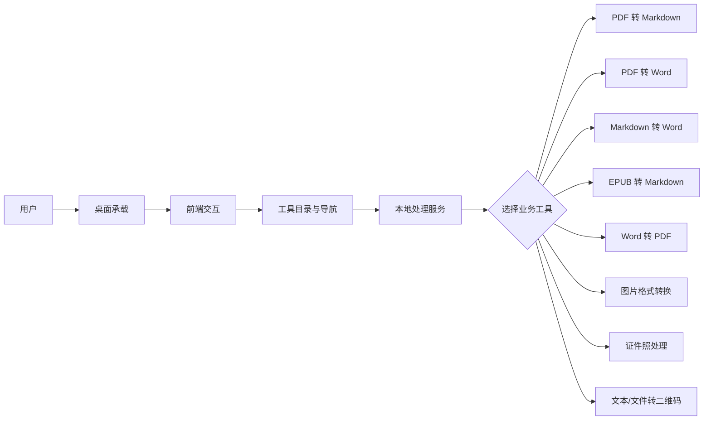
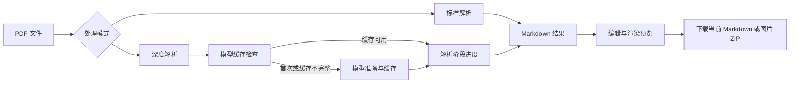
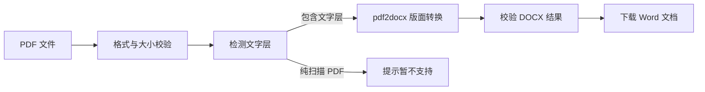
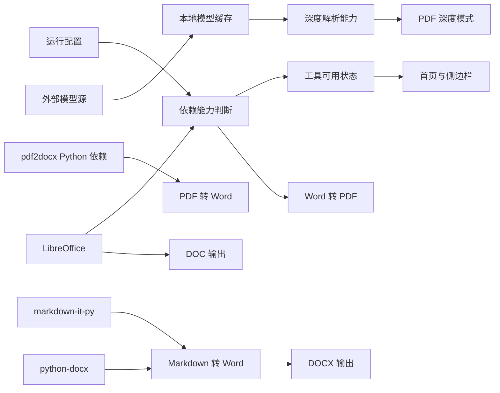
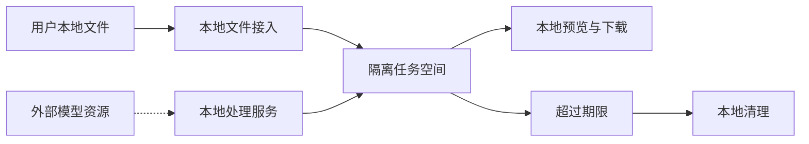
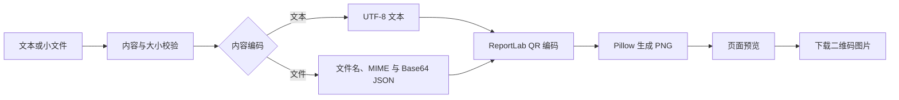
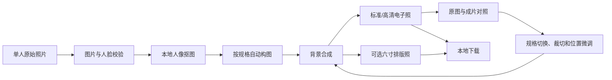

# 工具盒子 — 模块说明文档

> 本文档从业务需求和功能设计角度说明工具盒子的模块边界、端侧职责、依赖关系与典型流程。
> `doc/项目结构文档.md` 负责说明代码组织，本文档负责说明各模块如何共同支撑用户目标。
> 更新日期：2026-08-24
>
> **项目基础信息**
>
> | 范畴 | 技术栈或依赖 | 版本信息 | 主要职责 |
> | --- | --- | --- | --- |
> | 桌面应用 | Electron | 43.2.0 | 提供桌面窗口、应用生命周期和本地进程协同 |
> | 运行环境 | Node.js | >= 18.0.0（前端工程约束） | 支持前端开发和桌面应用运行链路 |
> | 前端框架 | Vue、Vue Router、Pinia | Vue 3.5.13、Vue Router 4.5.0、Pinia 3.0.2 | 提供工具入口、交互流程、状态展示和结果操作 |
> | 前端工程化 | Vite、TypeScript、Tailwind CSS | Vite 6.3.0、TypeScript 5.7、Tailwind CSS 4.1.4 | 负责前端构建、类型约束和界面样式 |
> | 图标与内容展示 | Font Awesome、Marked、Highlight.js、markdown-it-py | Font Awesome 6.7.2、Marked 18.0.5、Highlight.js 11.11.1、markdown-it-py 4.2.0 | 提供界面图标、Markdown 渲染、代码高亮和后端 Markdown 结构解析 |
> | 后端框架 | Python、FastAPI、Uvicorn | Python >= 3.12、FastAPI >= 0.138.0、Uvicorn >= 0.49.0 | 提供本地文件处理、工具能力编排和统一错误反馈 |
> | PDF 处理 | PyMuPDF、MinerU、pdf2docx | PyMuPDF >= 1.27.2.3、MinerU >= 3.2.0、pdf2docx == 0.5.13 | 分别支持常规解析、含模型准备阶段的复杂版面深度解析和文字型 PDF 转 Word |
> | EPUB 处理 | markdownify | >= 0.14.1 | 将电子书章节内容整理为 Markdown |
> | 图片与证件照处理 | Pillow、OpenCV、ONNX Runtime、MTCNN Runtime | Pillow >= 12.2.0、OpenCV >= 4.11.0.86、ONNX Runtime >= 1.15.0、MTCNN Runtime >= 1.0.0 | 支持图片转换、证件照抠图、人脸关键点、换底和规格化输出 |
> | 证件照模型资源 | MODNet、MTCNN ONNX 权重 | 模型文件版本未固定 | 在项目本地资源目录完成人像抠图和人脸检测，不上传用户照片 |
> | 二维码生成 | ReportLab、Pillow | ReportLab >= 5.0.0、Pillow >= 12.2.0 | 将文本或小文件编码为 PNG 二维码 |
> | Word 处理 | python-docx、LibreOffice | python-docx == 1.2.0；LibreOffice 外部运行时依赖，版本未固定 | 生成 DOCX，并将 DOCX 转换为旧版 DOC 或 PDF |
> | 数据保存 | 本地临时任务文件与页面内存 | 转换工具和证件照使用临时文件；Markdown 资源 ZIP 在任务目录内解包；二维码使用内存 Data URL | 保存常规转换的输入副本、解包资源、中间结果、结果和下载产物；二维码结果不写入任务目录，按页面和下载生命周期管理 |

---

## 1. 文档定位

本文档面向产品设计、开发、测试和架构评审人员，用于理解系统提供的业务能力、每个模块负责的用户目标，以及模块之间如何协作完成一次转换任务。它不替代代码组织文档，也不展开具体文件、类、接口参数或实现步骤。

建议先阅读第 2 至第 4 节建立整体认识，再阅读第 5 节了解单个模块，最后结合第 7、8 节理解跨模块流程和完整业务闭环。

## 2. 系统功能定位

工具盒子是一个**本地优先的桌面工具集合**：用户在统一入口中完成文档转换、电子书整理、图片转换、证件照处理或二维码生成，并在本地预览、调整或下载结果。

系统当前围绕以下能力方向设计：

| 能力方向 | 用户需求 | 系统提供的能力 |
| --- | --- | --- |
| 统一工具入口 | 用户需要快速找到并切换工具 | 首页工具总览、侧边栏导航、工具可用状态展示 |
| 文档格式处理 | 用户需要把常见文档转换为更易编辑或流转的格式 | PDF 转 Markdown、PDF 转 Word、Markdown 转 Word、EPUB 转 Markdown、Word 转 PDF |
| 复杂文档解析 | 用户面对扫描件、复杂版面或多栏文档时需要更高质量的结构提取 | PDF 标准解析与深度解析两种模式 |
| 图片格式处理 | 用户需要在不同图片格式之间转换，或一次处理多张图片 | 单张转换、批量转换、质量设置和 ZIP 打包下载 |
| 证件照处理 | 用户需要在本地完成单人证件照的抠图、换底、规格输出和排版 | 动态规格、原图/成片对照、自动构图、背景替换、结果微调、电子照片和六寸排版照 |
| 内容分享与携带 | 用户需要把短文本或小文件编码成便于扫描的图像 | 文本二维码、文件二维码、二维码预览和 PNG 下载 |
| 本地隐私与可控交付 | 用户希望文件不经过业务云端，并能明确掌握结果 | 本地处理、任务隔离、结果预览、结果下载和过期清理 |

## 3. 端侧职责划分

| 端侧或能力层 | 职责定位 | 主要关注点 | 不承担的职责 |
| --- | --- | --- | --- |
| 桌面承载层 | 负责应用启动、窗口管理和本地运行环境协同 | 后端就绪确认、窗口控制、退出时清理本地进程 | 不判断具体文件格式，也不执行转换规则 |
| 前端交互层 | 负责工具发现、文件选择、参数设置、进度展示、预览和下载 | 用户流程完整、状态清晰、不可用工具正确提示 | 不直接实现文档、图片或二维码生成 |
| 本地处理服务层 | 负责校验文件、调用处理引擎、管理任务结果和返回业务错误 | 工具边界、任务隔离、依赖检测、结果可追溯 | 不负责页面布局和桌面窗口表现 |
| 本地任务存储层 | 负责保存转换过程中的临时输入、输出和下载产物 | 任务目录隔离、路径安全、文件生命周期、过期清理 | 不承担长期用户资料、账号或云端同步 |
| 本地处理引擎层 | 负责具体格式解析和转换 | 引擎能力差异、超时、资源占用、输出质量 | 不决定工具入口和用户交互流程 |
| 外部运行时依赖 | 为特定能力提供运行环境或模型资源 | LibreOffice 的可用性、深度解析模型的获取、缓存与首次准备时间 | 不接收业务层面的用户操作和任务编排 |

当前产品没有独立的账号体系和云端业务服务。用户文件由本地处理服务完成处理；深度解析首次使用或本地模型缓存不完整时，会从当前配置的外部模型源获取模型并保存到用户数据目录，后续任务复用本地缓存。模型准备阶段只影响深度模式，不改变用户文件以本地处理为主的数据边界。

## 4. 功能模块总览

| 模块 | 业务定位 | 核心产出 | 直接依赖 |
| --- | --- | --- | --- |
| 应用承载与窗口 | 提供稳定的桌面运行外壳 | 应用窗口、启动协同、优雅退出 | 前端交互层、本地处理服务 |
| 工具目录与导航 | 统一管理工具入口和可用状态 | 首页工具总览、侧边栏、工具切换 | 应用承载与窗口、各业务工具、本地能力状态 |
| PDF 转 Markdown | 将 PDF 内容整理为可编辑的 Markdown | Markdown 文本或含图片资源的 ZIP 包、结构统计 | 文件校验、PDF 处理引擎、任务结果交付 |
| PDF 转 Word | 将包含文字层的 PDF 转换为可编辑 Word | DOCX 文件、页数信息、转换警告 | 文件校验、PyMuPDF、pdf2docx、任务结果交付 |
| Markdown 转 Word | 将 Markdown 文档或带图片资源的 ZIP 转换为可编辑 Word | DOCX 或 DOC 文件、输出文件名、转换警告 | Markdown 解析、python-docx、LibreOffice、任务结果交付 |
| EPUB 转 Markdown | 将 EPUB 电子书章节整理为 Markdown | 章节化 Markdown、图片资源、ZIP 下载包 | 文件安全校验、EPUB 处理引擎、任务结果交付 |
| Word 转 PDF | 将 Word 文档转换为可分发的 PDF | PDF 文件、原始文件名对应关系 | LibreOffice、本地任务存储、工具可用性判断 |
| 图片格式转换 | 将图片转换为指定格式并交付结果 | 单张图片、批量图片清单或 ZIP 包 | 图片处理引擎、文件限制校验、任务结果交付 |
| 证件照处理 | 在本地将单人照片处理为可调整的证件照结果 | 标准电子照、高清电子照、可选六寸排版照 | Pillow、OpenCV、ONNX Runtime、MTCNN、项目内模型资源、任务结果交付 |
| 文本/文件转二维码 | 将短文本或小文件编码为可扫描的二维码图片 | PNG 二维码、来源文件名、编码大小 | 文件校验、ReportLab QR 编码器、Pillow |
| 任务结果交付 | 统一承接各工具的预览、下载和生命周期 | 任务结果、预览内容、下载文件、过期清理 | 文档和图片转换工具、本地任务存储 |
| 通用运行支撑 | 为跨模块流程提供一致的边界和反馈 | 文件校验、进度状态、错误提示、隐私边界 | 桌面承载层、前端交互层、本地处理服务 |

## 5. 各业务模块说明

### 5.1 应用承载与窗口

- **定位**：为工具盒子提供桌面应用的运行外壳，使前端界面和本地处理服务能够被统一启动、使用和关闭。
- **核心功能**：
  - 启动并协调前端界面与本地处理服务。
  - 在处理服务真正就绪后再进入可操作状态。
  - 提供窗口最小化、最大化、还原和关闭能力。
  - 区分开发运行和打包运行时的页面加载方式。
  - 应用退出时回收由应用启动的本地进程。
- **设计边界**：不包含任何 PDF、EPUB、Word 或图片的业务规则；不决定工具是否可用；不保存用户转换结果。
- **关联模块**：工具目录与导航、本地处理服务、任务结果交付。
- **开发关注点**：
  - 启动失败必须能够区分前端未就绪、处理服务未就绪和外部依赖不可用。
  - 关闭应用时不能遗留由应用启动的本地处理进程。
  - 窗口控制只影响桌面承载，不应改变工具页面的业务状态。
  - 新增工具不应要求桌面承载层增加工具专属分支。

### 5.2 工具目录与导航

- **定位**：为用户提供所有工具的统一发现、进入和切换入口，并反映工具当前是否具备使用条件。
- **核心功能**：
  - 在首页展示工具名称、用途和可用状态。
  - 在侧边栏提供工具之间的快速切换。
  - 进入工具页面时展示当前工具，并保持导航状态一致。
  - 对缺少必要运行依赖的工具进行灰化和不可进入处理。
  - 在工具不存在或路径无效时提供兜底页面。
- **设计边界**：只负责入口、展示和导航，不处理文件、不执行转换，也不替代各工具页面的参数校验。
- **关联模块**：应用承载与窗口、PDF 转 Markdown、PDF 转 Word、Markdown 转 Word、EPUB 转 Markdown、Word 转 PDF、图片格式转换、证件照处理、文本/文件转二维码、通用运行支撑。
- **开发关注点**：
  - 首页和侧边栏必须展示同一套工具信息，避免入口状态不一致。
  - 工具的可用状态应来自实际运行能力，不能只依据界面配置判断。
  - 不可用工具需要在进入前给出原因，不应让用户进入后才发现无法使用。
  - 新增工具应同时具备名称、用途、入口和可用状态，不能只增加一个页面。

### 5.3 PDF 转 Markdown

- **定位**：将 PDF 中的文本、表格和图片信息整理为可继续编辑和流转的 Markdown 内容。
- **核心功能**：
  - 接收 PDF 文件并进行格式、大小和可解析性校验。
  - 提供标准解析和深度解析两种处理模式。
  - 标准模式面向常规 PDF，强调处理速度和即时反馈。
  - 深度模式面向扫描件、复杂版面和多栏内容，提供模型准备、解析和结果处理等阶段性进度。
  - 首次使用或模型缓存不完整时，提示模型准备阶段并将模型缓存到本地；缓存可用后再执行 PDF 深度解析。
  - 深度解析结果收集时将 MinerU 输出的原始 HTML 表格归一化为 Markdown 管道表格，保证预览、编辑和后续 Markdown 转 Word 可用。
  - 展示 Markdown 原文、渲染预览和页数、表格数、图片数等统计信息。
  - 允许用户在结果阶段调整 Markdown 内容，并下载当前内容。
  - 模型下载失败、解析失败或超时时显示可理解原因，并支持重新上传。
- **设计边界**：不负责 EPUB、Word 或图片转换；不保证所有 PDF 的视觉排版被完全还原；深度模式不等同于远程人工校对服务，也不保证首次模型准备在离线环境完成。
- **关联模块**：工具目录与导航、任务结果交付、通用运行支撑、PDF 处理引擎、外部模型资源。
- **开发关注点**：
  - 处理模式应由用户明确选择，不能在没有说明的情况下隐式切换。
  - 深度模式应区分排队、模型准备、解析、结果处理、完成和失败状态，不能用“结果不存在”代替已知失败原因。
  - 多个深度任务应按队列处理，避免同时加载大模型造成资源竞争。
  - 预览内容与最终下载内容的关系要清楚，用户编辑后的内容应以当前编辑结果为准。
  - 图片和表格等资源的统计、引用和下载行为应保持一致。
  - 任务结果过期后应给出可理解的重新处理提示。

### 5.4 PDF 转 Word

- **定位**：将包含文字层的 PDF 文件转换为可继续编辑和流转的 DOCX 文档。
- **核心功能**：
  - 接收单个 PDF 文件并校验扩展名、大小、可解析性和加密状态。
  - 使用 PyMuPDF 检测文字层，使用 pdf2docx 完成版面解析和 DOCX 生成。
  - 保留基础段落、图片、表格和页面结构，并返回页数和可能的转换警告。
  - 尽量保留原始文件名，将输出扩展名替换为 `.docx`。
  - 为每次转换建立独立任务目录，转换完成后提供 DOCX 下载。
  - 对纯扫描 PDF、损坏 PDF、超限文件和无效结果给出可理解的失败反馈。
- **设计边界**：首版只输出 `.docx`，不输出旧版 `.doc`；不提供批量转换、OCR、文档编辑或像素级版式保证；纯扫描 PDF 暂不自动转换。
- **关联模块**：工具目录与导航、任务结果交付、通用运行支撑、PyMuPDF、pdf2docx。
- **开发关注点**：
  - 文件扩展名只作初筛，必须通过 PDF 实际解析确认内容。
  - 任务目录、输出文件名和下载路径必须与用户输入路径隔离。
  - 生成的 DOCX 必须经过压缩包结构和核心文档文件校验。
  - 混合文字/图片 PDF 允许转换，但应明确告知部分页面可能需要人工校对。
  - OCR 和扫描件支持应作为后续独立引擎扩展，不能静默改变首版结果语义。

### 5.5 EPUB 转 Markdown

- **定位**：将 EPUB 电子书中的章节内容、基础排版和图片资源整理为可阅读、可继续利用和可打包保存的 Markdown 文档。
- **核心功能**：
  - 接收 EPUB 文件并校验格式、大小、压缩包结构和解压安全性。
  - 解析 EPUB 2/EPUB 3 的书籍结构和章节阅读顺序。
  - 将 XHTML 或 HTML 正文转换为 Markdown，保留标题、段落、列表、链接、表格和基础格式。
  - 提取正文引用的图片，并在结果包中维护相对资源关系。
  - 在页面中展示章节数、表格数、图片数和 Markdown 预览。
  - 下载包含正文和图片资源的 ZIP 文件。
  - 对损坏、结构缺失、非法路径和过度膨胀的 EPUB 给出失败反馈。
- **设计边界**：不处理 DRM、脚本交互、音视频、固定布局的视觉还原，也不负责把 Markdown 写回 EPUB。
- **关联模块**：工具目录与导航、任务结果交付、通用运行支撑、EPUB 处理引擎。
- **开发关注点**：
  - 章节顺序应以电子书的阅读结构为依据，并处理导航信息不完整的情况。
  - 资源路径必须限制在当前电子书和当前任务范围内，不能允许路径穿越。
  - 预览时应明确图片资源需要在下载包中查看，避免产生资源丢失的误解。
  - ZIP 下载包中的正文、图片和原始文件名应保持可追溯关系。

### 5.6 Word 转 PDF

- **定位**：将 Word 文档转换为便于分享、打印和跨环境查看的 PDF 文件。
- **核心功能**：
  - 接收 `.doc` 和 `.docx` 文件并进行格式、大小和内容校验。
  - 使用本地办公文档转换能力完成同步处理。
  - 在处理过程中展示明确的等待状态，完成后提供下载入口。
  - 尽量保留原始文件名，并将输出扩展名替换为 PDF。
  - 在本地转换能力缺失时，将工具标记为不可用并说明依赖条件。
  - 对未安装、超时、转换失败和未生成结果等情况提供可理解的反馈。
- **设计边界**：不提供文档内容编辑、页面预览、批量转换或第二套转换引擎；不负责安装或修复办公软件运行时。
- **关联模块**：工具目录与导航、任务结果交付、通用运行支撑、LibreOffice 运行时依赖。
- **开发关注点**：
  - 依赖检测结果必须同时影响入口状态和实际处理状态。
  - 外部转换进程需要设置合理的超时和失败边界。
  - 输出文件名应保持用户可理解，并避免覆盖不同任务的结果。
  - 不同操作系统上的办公软件路径和窗口行为不能泄漏到用户操作流程中。

### 5.7 图片格式转换

- **定位**：为用户提供常见图片格式之间的单张或批量转换，并根据目标格式提供适当的质量控制。
- **核心功能**：
  - 支持 PNG、JPEG、WebP、BMP、GIF 和 TIFF 等格式。
  - 支持拖拽或选择多张图片，单次最多处理 20 张。
  - 支持选择目标格式，并在 JPEG、WebP 等有损格式下调整质量。
  - 单张转换后提供图片预览和单文件下载。
  - 批量转换后提供逐张下载和 ZIP 打包下载。
  - 处理透明色、色彩模式、多页 TIFF 和动画 GIF 等常见兼容场景。
  - 对格式不支持、文件过大、像素过高和转换失败提供反馈。
- **设计边界**：不提供裁剪、滤镜、修图、OCR 或图片内容编辑；不以该模块承担长期图片存储；结果不承诺保留全部原始元数据。
- **关联模块**：工具目录与导航、任务结果交付、通用运行支撑、图片处理引擎。
- **开发关注点**：
  - 文件数量、单文件大小和像素数量应在转换前明确限制。
  - 质量参数只应影响支持该参数的目标格式，其他格式应保持界面和结果语义一致。
  - 批量结果中的原始名称、转换名称和下载顺序必须清楚对应。
  - 多页或动画图片的输出策略需要在结果中可理解，不能静默丢失用户预期内容。
  - 预览使用的临时资源应随任务结束或重新上传及时释放。

### 5.8 文本/文件转二维码

- **定位**：将短文本或小文件编码为可扫描、可预览和可下载的 PNG 二维码，满足本地携带和分享需求。
- **核心功能**：
  - 支持文本输入，按 UTF-8 字节数校验二维码容量。
  - 支持选择或拖拽文件，将文件名、MIME 类型和 Base64 内容包装后编码。
  - 在本地处理服务生成二维码 PNG，并在页面中预览。
  - 根据内容来源生成清晰的下载文件名，支持下载二维码图片。
  - 覆盖输入、处理中、生成完成和失败状态，并对超容量内容给出可恢复提示。
- **设计边界**：首版只生成单张二维码，不拆分为二维码序列、不托管公网下载链接；文件原始内容最大约 1.5KB，单个二维码编码内容最大约 2.5KB。文件二维码的扫描结果是带元数据的 JSON 内容，需要支持相应解析方式才能还原文件。
- **结果存储生命周期**：二维码 PNG 在本地处理服务内存中生成，以 `image_data_url` 返回前端；后端不写入 `backend/temp/tasks`，前端仅在当前页面内存中暂存。用户点击下载后由系统浏览器保存到默认下载目录或用户选择的位置；页面关闭、刷新或重新生成前未下载的二维码不会保留。上传文件仅在当前请求期间读取，不持久化保存。
- **关联模块**：工具目录与导航、通用运行支撑、ReportLab QR 编码器、Pillow。
- **开发关注点**：
  - 前端提示和后端校验必须同时守住文本字节数、文件大小和单码容量边界。
  - 文件名必须经过净化后再写入二维码内容和输出文件名，不能作为路径使用。
  - 生成日志只记录来源类型和编码大小，不记录文本或文件内容。
  - 二维码输出应保留足够的白边，确保常见扫码设备能够识别。

### 5.9 证件照处理

- **定位**：面向需要报名、考试或证件材料照片的用户，在本地完成单人照片的抠图、换底、规格化输出和排版，减少照片在第三方网站上传的隐私风险。
- **核心功能**：
  - 接收一张静态人像照片，校验图片实际内容、大小和像素规模。
  - 按常用一寸、二寸/小二寸和自定义尺寸生成证件照，并可在同一任务中切换规格。
  - 自动检测单张主要人脸，根据所选规格完成构图并保留合理的头顶和肩部空间。
  - 使用本地模型完成人像抠图，支持白、蓝、红和自定义背景换底。
  - 并排展示本地原图和证件照成片，并提供标准照与高清照。
  - 支持 JPEG 质量、DPI 和单文件 KB 压缩目标设置。
  - 结果阶段允许用户切换规格、调整裁切范围和位置，调整后基于本地中间结果重新渲染，不重复检测和抠图。
  - 任务结果在本地临时目录中隔离保存，并按统一过期规则清理。
- **设计边界**：不提供美颜、换脸、生成式修复、多人批处理、云端处理、国际证件模板或机构级合规保证；用户仍需以目标机构最新要求为准。
- **关联模块**：工具目录与导航、任务结果交付、通用运行支撑、Pillow、OpenCV、ONNX Runtime 和项目内模型资源。
- **开发关注点**：
  - 模型缺失或运行能力不可用时，入口和实际处理都必须给出明确状态。
  - 人脸检测器、抠图模型、规格模板和排版规则应保持可替换或可配置，避免把实验性模型写死为公共承诺。
  - 任务目录只能保存重新渲染所需的中间结果和输出，日志不能记录原图或完整敏感内容。
  - 模型权重来源、许可证和目标发布环境的 Python 3.12/CPU 兼容性需要在正式发布前形成核验记录。

### 5.10 任务结果交付

- **定位**：为所有转换工具提供统一的结果承接能力，使用户能够查看、下载、重新处理并在合理期限内管理转换产物。
- **核心功能**：
  - 为每次转换建立相互隔离的任务空间。
  - 保存原始文件关联信息、转换结果和必要的资源文件。
  - 根据工具能力提供 Markdown 预览、图片预览、单文件下载或 ZIP 下载。
  - 在下载时维持原始文件名或清晰的结果命名。
  - 对不存在、损坏或已过期的任务结果给出明确反馈。
  - 在本地服务启动时清理超过保留期限的临时任务和上传残留。
- **设计边界**：不决定具体格式如何转换，不提供用户账号下的长期文件库，也不负责跨设备同步和版本管理。
- **关联模块**：PDF 转 Markdown、PDF 转 Word、Markdown 转 Word、EPUB 转 Markdown、Word 转 PDF、图片格式转换、证件照处理、本地任务存储、通用运行支撑。
- **开发关注点**：
  - 不同任务之间必须隔离输入、输出和下载权限。
  - 结果预览的内容应与实际可下载产物保持可解释的一致性。
  - 文件名、资源目录和压缩包结构不能引入覆盖或路径越界风险。
  - 清理策略应兼顾结果可用期限和本地磁盘占用。

### 5.11 Markdown 转 Word

- **定位**：将 Markdown 文档转换为可继续编辑和流转的 DOCX 或 DOC 文件，作为独立工具使用。
- **核心功能**：
  - 接收 `.md`、`.markdown` 文件，或包含且仅包含一个 Markdown 文件的 ZIP；ZIP 可选携带 `images/` 及其他相对资源目录。
  - 上传文件上限 50MB；ZIP 最多 512 个条目，解压后总大小不超过 200MB，并执行路径穿越和符号链接校验。
  - 基于 CommonMark 解析标题、段落、粗体、斜体、删除线、链接、列表、引用、分割线、代码块、表格和图片；规整的原始 HTML 表格先归一化为管道表格再写入 DOCX，其余 HTML 忽略并返回警告。
  - 默认生成 DOCX；选择 DOC 时先生成 DOCX，再调用本地 LibreOffice 转换为旧版 Word 文档。
  - 生成独立任务目录，保存输入、解包资源、DOCX 中间结果和最终下载产物。
  - 返回输出文件名和非致命转换警告；用户可重新上传或下载结果。
- **设计边界**：不抓取远程图片；不执行原始 HTML，仅将规整的 HTML 表格转换为 Word 表格，其余 HTML 忽略并给出警告；不支持 ZIP 中多个 Markdown 文档；复杂排版、脚本、数学公式和高级扩展不承诺完整还原。
- **关联模块**：工具目录与导航、任务结果交付、通用运行支撑、markdown-it-py、python-docx、LibreOffice。
- **开发关注点**：
  - ZIP 解包必须限制条目数、解压体积、符号链接和路径穿越。
  - 图片路径只能访问当前 Markdown 所在目录及其子目录，远程图片应转为警告。
  - DOCX 生成后必须校验压缩包结构；DOC 生成后必须校验文件存在且非空。
  - LibreOffice 缺失时 DOCX 仍可用，DOC 转换应返回明确的依赖错误。

## 6. 通用支撑能力

### 6.1 文件接入与安全边界

- **职责**：统一承接文件选择、格式识别、大小限制、数量限制、内容可解析性和压缩包安全检查。
- **使用原则**：先校验，再创建任务；文件扩展名只作为初步判断，最终结果必须经过内容和处理引擎确认。
- **开发时应避免**：只校验文件名、不限制解压后的体积、不限制图片像素，或把用户提供的文件名直接作为本地路径。

### 6.2 任务状态与进度反馈

- **职责**：让用户能够理解当前处于待处理、处理中、已完成还是失败状态，并区分同步处理和长任务处理。
- **使用原则**：短任务可使用明确的处理中状态；长任务应提供真实阶段和可识别的失败状态。
- **开发时应避免**：用虚假的精确百分比掩盖未知进度、页面刷新后继续展示已失效结果，或让失败任务停留在无限加载状态。

### 6.3 统一错误反馈与可用性判断

- **职责**：将文件错误、依赖缺失、转换失败、超时和结果过期转换为用户可理解的反馈，并在入口处反映必要依赖。
- **使用原则**：能在进入工具前判断的条件，应尽量提前提示；处理过程中产生的错误，应说明原因和可恢复动作。Markdown 转 Word 整体由 DOCX 能力决定可用性；LibreOffice 只影响 DOC 输出选项，缺失时仍应允许生成 DOCX，并在选择 DOC 时返回明确依赖错误。
- **开发时应避免**：只记录日志而不反馈用户、所有错误都显示为同一句话，或让界面显示可用但实际无法运行的工具。

### 6.4 本地任务存储与生命周期

- **职责**：隔离不同转换任务的输入、输出和中间资源，并控制临时文件保留时间；二维码工具不创建任务目录，结果只在请求和页面内存中短暂存在。
- **使用原则**：常规任务空间按任务隔离，下载只允许访问当前任务范围内的产物，过期任务按统一规则清理；二维码生成结果以 Data URL 返回，用户下载后由系统负责保存。
- **开发时应避免**：把任务结果写入公共目录、允许任务标识访问任意文件，或误把二维码的内存结果描述为后端持久化文件。

### 6.5 结果预览与下载

- **职责**：根据业务类型提供合适的结果确认方式，并让用户明确知道预览内容与下载产物的关系。
- **使用原则**：文档类工具优先支持文本预览，图片类工具优先支持视觉确认，资源型结果使用 ZIP 保持关联资源完整。
- **开发时应避免**：为没有预览能力的格式制造虚假预览、丢失图片等关联资源，或让用户无法判断下载文件的来源和命名。

### 6.6 统一界面与导航体验

- **职责**：为工具页面提供一致的入口、上传、处理中、结果和失败反馈体验。
- **使用原则**：各工具可以有不同参数和结果形态，但用户应能用相似的心智模型完成“选择文件—处理—确认结果—下载或重来”。
- **开发时应避免**：在单个工具中改变全局导航语义、绕过可用性判断直接进入页面，或让不同工具对同一状态使用相互矛盾的文案。

## 7. 模块间关键关系

模块依赖遵循从承载到交互、从交互到处理、从处理到结果交付的单向关系。PDF、EPUB、Word、图片和二维码相关业务模块彼此独立，不应互相调用；它们共享通用运行支撑，二维码工具不创建长期任务结果。

### 7.1 应用启动与工具使用关系

**说明**：桌面承载层只负责让应用可用，工具目录负责引导用户，具体转换由本地处理服务交给对应业务模块完成。

### 7.2 通用内容处理链路

**说明**：文档和图片工具共享“先校验、再处理、后交付”的基本链路；二维码工具在本地内存中完成编码并直接交付 PNG，不建立长期任务目录。

### 7.3 PDF 双模式处理关系

**说明**：两种模式最终汇聚到同一套 Markdown 结果交付流程；深度模式在解析前还要检查本地模型缓存，必要时先完成模型准备，再进入解析阶段。Markdown 存在图片资源引用时，下载产物为包含 Markdown 与 `images/` 的 ZIP 包。

### 7.4 PDF 转 Word 处理关系

**说明**：首版只处理包含文字层的 PDF。混合文字/图片页面可以转换但可能需要人工校对；纯扫描 PDF 不自动走 OCR，避免静默改变可编辑性预期。

### 7.5 配置与处理能力依赖关系

**说明**：外部运行时依赖影响特定能力的可用性。LibreOffice 直接影响 Word 转 PDF 工具入口和 Markdown 转 DOC 的可选输出，pdf2docx 依赖影响 PDF 转 Word；markdown-it-py 和 python-docx 随后端运行时提供 Markdown 解析与 DOCX 生成；深度模式首次使用或缓存不完整时需要从外部模型源准备本地模型，模型缓存影响深度模式的启动时间和可用性；常规 PDF、EPUB 和图片转换不依赖这些深度解析模型。

### 7.6 用户数据边界与任务生命周期

**说明**：用户文件和转换结果以本地任务为边界保存，结果在本地交付并按期限清理；外部资源关系主要用于获取深度解析模型，不构成用户文件的业务存储。

### 7.7 文本/文件转二维码处理关系

**说明**：二维码工具只在本地处理短文本或小文件。文件内容会被包装为带元数据的 JSON 后写入单个二维码；超过容量的内容直接拒绝，不通过公网链接或隐式分片规避限制。PNG 结果以 Data URL 在前端预览，只有用户主动下载后才交给系统文件保存流程。

### 7.8 证件照处理关系

**说明**：证件照模块复用本地任务结果交付和临时清理边界。人像检测与抠图只在初次处理阶段执行，规格、背景色、裁切范围和位置在同一任务中重新渲染；原图对照仅使用页面内本地 URL，不新增服务端原图缓存。模块不对目标机构的最终审核结果作保证。

### 7.9 Markdown 转 Word 处理关系

**说明**：独立工具以 Markdown 文件为主体；需要本地图片时，ZIP 内的图片路径按照 Markdown 相对路径解析。DOC 是 DOCX 的兼容性后处理结果，不改变 DOCX 主转换链路。

## 8. 典型业务闭环

### 闭环 1：打开应用并选择可用工具

1. 用户启动工具盒子，桌面承载层协调前端和本地处理服务。
2. 应用确认本地处理服务就绪后展示首页。
3. 首页加载工具目录，展示工具用途和当前可用状态。
4. 用户通过首页或侧边栏选择可用工具。
5. 若某工具依赖缺失，入口保持不可进入并展示原因，用户可改用其他工具。

### 闭环 2：将 PDF 转换为可编辑 Markdown

1. 用户进入 PDF 工具并选择 PDF 文件。
2. 系统校验文件格式、大小和可解析性。
3. 用户选择标准解析或深度解析模式。
4. 标准模式完成常规解析；深度模式先检查模型缓存，必要时准备模型，再展示解析阶段进度。
5. 系统生成 Markdown 结果和内容统计。
6. 用户在预览区域确认或调整 Markdown 内容。
7. 用户下载当前内容（有图片资源时为包含 Markdown 与 `images/` 的 ZIP 包），或重新上传文件开始下一次处理。
8. 若模型准备、解析或结果处理失败，系统展示具体原因并提供重新处理路径。

### 闭环 3：将 PDF 转换为 Word

1. 用户从首页或侧边栏进入 PDF 转 Word 工具。
2. 用户选择 PDF 文件，系统校验格式、大小、加密状态和可解析性。
3. 系统检测 PDF 是否包含文字层；纯扫描 PDF 提示当前版本暂不支持。
4. 本地处理服务调用 pdf2docx 生成 DOCX，并校验输出结果。
5. 用户查看页数、输出文件名和可能的转换警告。
6. 用户下载 Word 文档，或重新上传其他 PDF。

### 闭环 4：整理 EPUB 电子书

1. 用户进入 EPUB 工具并选择电子书文件。
2. 系统校验 EPUB 包结构、章节信息、资源路径和解压安全边界。
3. 系统按电子书阅读顺序处理章节，并将正文转换为 Markdown。
4. 系统提取正文引用的图片，建立与 Markdown 的资源关系。
5. 用户查看章节统计和 Markdown 预览。
6. 用户下载包含正文和图片资源的 ZIP 文件，或重新上传其他电子书。

### 闭环 5：将 Word 文档转换为 PDF

1. 用户从首页或侧边栏进入 Word 工具。
2. 系统先确认本地办公文档转换依赖可用。
3. 用户选择 `.doc` 或 `.docx` 文件，系统校验格式和大小。
4. 本地处理服务完成转换并展示处理中状态。
5. 转换成功后展示原始文件名对应的 PDF 结果。
6. 用户下载 PDF，或重新上传另一份 Word 文档。
7. 若依赖缺失、超时或转换失败，系统说明原因并提供重新处理路径。

### 闭环 6：单张或批量转换图片

1. 用户进入图片工具并选择一张或多张图片。
2. 系统校验图片格式、文件大小、图片数量和像素规模。
3. 用户选择目标格式，并在适用时设置图片质量。
4. 系统完成转换并生成本次任务的结果清单。
5. 单张任务展示图片预览和文件信息，用户下载单张结果。
6. 批量任务展示每张图片的转换对应关系，用户逐张下载或下载 ZIP 包。
7. 用户重新上传后开始新的转换任务，旧任务按生命周期规则处理。

### 闭环 7：文本或文件转二维码

1. 用户从首页或侧边栏进入二维码工具。
2. 用户选择“文本”或“文件”模式，输入文本或选择文件。
3. 前端先校验文本字节数、文件大小和空内容。
4. 本地处理服务再次校验内容来源、文件大小和二维码编码容量。
5. 文本按 UTF-8 编码；文件包装为包含文件名、MIME 类型和 Base64 数据的 JSON。
6. 系统生成 PNG 二维码并在页面中预览，用户下载图片。
7. 若内容超过单个二维码容量，系统提示用户减少内容后重新生成。

### 闭环 8：生成和调整证件照

1. 用户从首页或侧边栏进入证件照工具；若本地模型或运行能力缺失，入口显示不可用原因。
2. 用户选择一张单人照片、规格模板、背景色和是否生成六寸排版照。
3. 前端和后端分别校验文件类型、大小、像素和模板参数。
4. 本地处理服务检测单人主体、自动构图并使用项目内模型抠图，随后按模板生成标准电子照、高清电子照和可选排版照。
5. 用户在结果页对照原图与成片，切换照片规格，或调整裁切范围、水平/垂直位置和背景色。
6. 系统基于当前任务的本地人像中间结果重新渲染，不重复上传、检测或抠图。
7. 用户下载目标文件；任务结果在临时目录中保留至统一清理期限，过期后自动删除。
8. 页面提示该结果是按所选模板生成的本地处理结果，最终是否符合目标机构要求以其最新规范为准。

### 闭环 9：将 Markdown 转换为 Word

1. 用户进入 Markdown 转 Word 工具，选择 `.md`、`.markdown` 或资源 ZIP。
2. 系统校验文件大小、扩展名和 ZIP 解包安全；ZIP 中必须包含一个 Markdown 文件。
3. 用户选择 DOCX 或 DOC 输出格式。
4. 系统解析 Markdown，将标题、段落、列表、表格、代码块和 Markdown 所引用的相对图片资源写入 DOCX。
5. 系统校验 DOCX；如果用户选择 DOC，则调用 LibreOffice 完成兼容格式转换并校验结果。
6. 用户查看输出文件名和转换警告，下载 Word 文件或重新上传。
7. 若图片不存在、远程图片被跳过、DOC 依赖缺失或转换失败，系统展示具体原因。

## 9. 后续开发参考原则

1. 新增功能应先定义用户要完成的完整目标，再划分模块，不以代码目录作为唯一模块边界。
2. 每个工具都应覆盖文件接入、处理中、结果和失败四类用户状态。
3. 工具首页、侧边栏和实际处理能力必须共享一致的工具名称、用途和可用状态。
4. 业务工具之间保持独立；跨工具共用的能力应沉淀到通用运行支撑或任务结果交付模块。
5. 依赖外部运行时的工具必须在入口阶段反映可用性，并在处理阶段保留失败反馈。
6. 长耗时任务应区分模型准备、排队、处理和结果交付等真实阶段，不能用不准确的进度数字代替状态管理。
7. 用户文件、任务结果和下载资源必须按任务隔离，任何结果访问都不能突破当前任务边界。
8. 预览内容、可编辑内容和最终下载内容的关系必须明确，尤其要区分只读预览和用户修改后的结果。
9. 对格式、大小、数量、像素和压缩包安全的限制应在用户开始处理前明确，并由处理侧再次守护。
10. 临时结果应有统一的保留和清理规则；除非明确形成新的产品需求，不把工具盒子扩展为长期文件管理系统。
11. 二维码功能必须显式说明单码容量、文件编码格式和不支持分片的边界，不能让用户误以为任意大小文件都能直接写入一张二维码。
